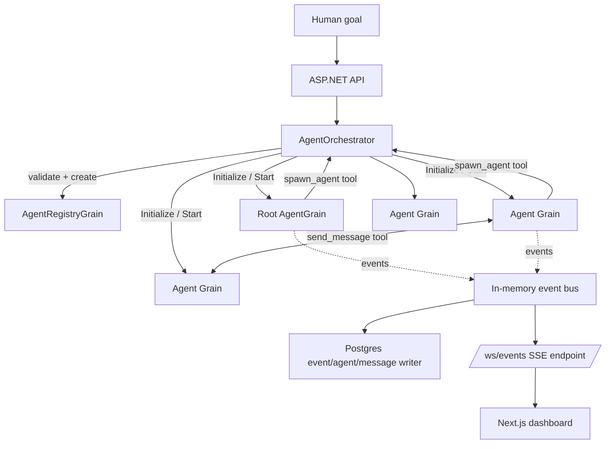
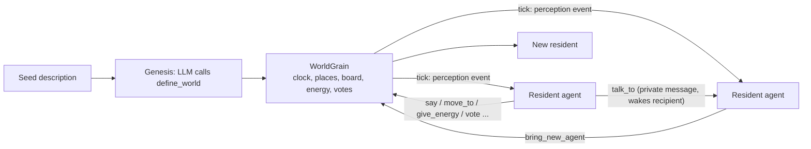
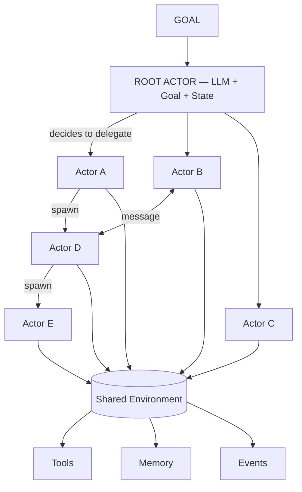

# Aktor Agents

A production-oriented prototype of an **autonomous multi-agent runtime based on the Actor Model**.

You give it a high-level goal — *"Research the feasibility of an AI-powered property management
SaaS"* or *"Add user authentication to this application"* — and it creates a Root Agent that
autonomously decides what work is needed, spawns specialized sub-agents (which can themselves
spawn further sub-agents), lets those agents communicate directly with each other, uses tools,
and eventually aggregates a final result. You watch the whole thing unfold live in a dashboard.
You do not orchestrate the agents by hand.

```
Human Goal → Root Agent → Autonomous Planning → Agent Spawn → Parallel Work
    → Agent-to-Agent Communication → Recursive Agent Spawn → Tool Usage
    → Results → Validation → Final Result
```

The core principle: **the LLM provides reasoning; the actor runtime provides execution,
isolation, messaging, lifecycle, resource management, and governance.** The LLM is never trusted
to enforce a system-level constraint — the runtime always is.

---

## 1. What's in here

```
/src
  /AgentRuntime               domain: agents, contracts, messaging, tools, LLM abstraction,
                               memory, prompt building — no infrastructure dependencies
  /AgentRuntime.Infrastructure  Postgres persistence, LLM provider implementations, concrete tools
  /AgentRuntime.Api            ASP.NET Core API + co-hosted Orleans silo
  /AgentRuntime.Tests          unit tests (no Orleans cluster needed)
  /AgentRuntime.IntegrationTests  tests against real Orleans grains, scripted LLM
  /web                        Next.js dashboard (React Flow agent graph, live event stream)
/docker                       Dockerfiles for the API and the web app
docker-compose.yml
.env.example
```

## 2. Actor Model architecture

Every agent is an **Orleans grain** (`AgentGrain`, behind `IAgentGrain`) — an isolated actor with
its own state, message queue, and single-threaded execution. Agents never touch each other's
state directly:

```
Agent = State + Behavior + Mailbox + Goal + Capabilities

Agent A  --message-->  Orleans messaging  --message-->  Agent B
```

The runtime — not the agent, not the LLM — is authoritative for everything that matters:
spawn limits, budgets, permissions, and lifecycle transitions. This lives in
`AgentOrchestrator` (the "Agent Runtime" from the spec — named to avoid clashing with this
project's own namespace) plus a singleton `AgentRegistryGrain` that tracks the whole tree and
validates every spawn request against `MAX_AGENT_DEPTH` / `MAX_CHILDREN_PER_AGENT` /
`MAX_TOTAL_AGENTS` / `MAX_ACTIVE_AGENTS`.



## 3. How an agent works

Each `AgentGrain` runs an event-driven think/act loop (`RunReasoningLoopAsync`), woken by its own
`Start()` call or by a message/event arriving while it's Idle/Waiting — never a busy-polling
thread per agent:

```
while goal not complete:
    build system prompt from current state (IAgentPromptBuilder, composed from sections —
        ROLE / GOAL / CURRENT STATE / TOOLS / RESOURCE LIMITS / MESSAGING RULES /
        SPAWNING RULES / COMPLETION CRITERIA / ENVIRONMENT — never one hard-coded string)
    call the LLM with the full tool catalog the agent is allowed to see
    for each tool call the LLM requests:
        runtime checks the agent is allowed to see this tool AND holds the required permission
        runtime executes it (or rejects it) — the LLM never touches runtime internals directly
    if it called complete_task: transition to Completed and stop
    if budget exhausted / max iterations reached / repeated identical tool call: stop safely
```

Lifecycle states follow an explicit machine (`AgentState.TransitionTo`) —
`Created → Initializing → Idle → Thinking → Executing/Spawning → Waiting → Completed`, with
`Failed`/`Terminated`/`TimedOut` branches. Arbitrary status mutation isn't possible; every
transition is checked against the state machine (or goes through the explicit `ForceStatus`
override reserved for operator-triggered Stop and terminal failure paths).

## 4. How agents spawn agents

`spawn_agent` is a governance tool available to every agent. The LLM decides it wants a
specialist; the runtime decides whether that's allowed:

```
Agent          spawn_agent(role, goal, capabilities)
  → SpawnAgentTool
    → AgentOrchestrator.SpawnAgentAsync
      → AgentRegistryGrain.ValidateSpawnAsync   (depth / children / total / active limits)
      → derive child's budget from the parent's *remaining* budget (never more, never
        self-escalated — CLAUDE.md §24/44)
      → derive child's tools/permissions as an intersection of what it asked for and what
        the parent itself was granted (a child can never see a tool or exercise a permission
        the parent didn't have)
      → create + Initialize + Start the child grain
```

Spawning is genuinely recursive — any agent, at any depth up to `MAX_AGENT_DEPTH` (default 5),
can spawn further agents. The end-to-end tests exercise a 3-level chain (root → research agent →
detail agent) as well as an attempt to exceed `MAX_CHILDREN_PER_AGENT`, which the runtime rejects.

## 5. How agents communicate

`send_message` lets any agent message any other agent directly — no need to route through the
root. Delivery is **asynchronous**: the sender's tool call returns as soon as the message is
appended to the recipient's mailbox, not once the recipient has replied.

This matters architecturally: Orleans grains are non-reentrant (one call executes at a time per
agent). If `SendMessage` synchronously ran the *entire* reasoning turn of the recipient — and
that recipient replied back to the sender before returning — you'd get a structural deadlock the
moment two agents reply to each other (A → B → A, blocked on itself). Instead, `SendMessage`
appends the message and fires a one-way `WakeAndThink()` call to itself; that runs as the grain's
*next* turn, after the current call has already returned. This is the actual mailbox-drop
semantics of an actor system, and it's covered by an integration test
(`AgentsCommunicateDirectly_WithoutGoingThroughRoot`) that specifically exercises a reply cycle.

Every message is treated as untrusted input by the receiver — it never grants permissions,
budget, or authority the receiver didn't already have (CLAUDE.md §51).

## 6. How the LLM interacts with the runtime

```csharp
public interface ILLMProvider
{
    string ProviderName { get; }
    Task<LlmCompletionResponse> CompleteAsync(LlmCompletionRequest request, CancellationToken ct = default);
}
```

`AnthropicProvider` is fully implemented against the Messages API, including structured tool use.
`OpenAIProvider` is a second complete implementation (Chat Completions API), proving the
abstraction holds across vendors without touching `AgentGrain`. `GeminiProvider` is a documented
stub — swap it in following the same pattern to add a third vendor. `HeuristicMockLlmProvider`
needs no API key at all and is what `docker compose up` uses by default — it inspects the
transcript to decide whether to spawn, recurse once, or complete, enough to demonstrate the whole
pipeline (including recursive spawning) with zero configuration.

Tool arguments and results use structured JSON, not free-text parsing — every tool declares a
JSON Schema and the LLM's tool calls are deserialized against it (`ToolJson.Options`, consistently
snake_case, matching the field names in every tool schema and in this document's own examples).

## 7. Running locally

Prerequisites: .NET 10 SDK, Node 20+, Docker (for `docker compose` and for the `shell_exec` tool's
sandboxing).

### Option A — Docker Compose (recommended, zero setup)

```bash
./run.sh          # copies .env.example -> .env on first run, then docker compose up --build
```

- API: http://localhost:5080
- Dashboard: http://localhost:3000

This runs with `LLM_PROVIDER=Mock` by default, so it works immediately with no API key.
Open the dashboard and create an account: the first one owns everything already on the server.
Set `PLATFORM_ADMIN_EMAIL` to that email to be the operator, who can reset the server (see
[docs/platform.md](docs/platform.md)).
`./run.sh -d` runs detached; extra arguments pass through to `docker compose up`.

**Starting over**: `./reset.sh` (operators only; it asks for your email and password, or reads
`AKTOR_EMAIL`/`AKTOR_PASSWORD`), or the "Reset all" button in the dashboard header, deletes every
task, agent, message, event, tool call, and artifact and clears the live agent registry, without
tearing the containers down. See §11.

### Option B — run the pieces yourself

```bash
# Postgres
docker run -d --name aktor-postgres -e POSTGRES_DB=aktor_agents -e POSTGRES_USER=aktor \
  -e POSTGRES_PASSWORD=aktor_dev_password -p 5432:5432 postgres:16-alpine

# API (applies EF Core migrations automatically on startup)
dotnet run --project src/AgentRuntime.Api

# Dashboard
cd src/web
npm install
NEXT_PUBLIC_API_BASE_URL=http://localhost:5080 npm run dev
```

## 8. Configuring an LLM provider

Set these in `.env` (Docker Compose) or `appsettings.Development.json` / environment variables
(running `dotnet run` directly):

```bash
LLM_PROVIDER=Anthropic        # Mock | Anthropic | OpenAI | Gemini
LLM_MODEL=claude-sonnet-5     # whatever model id your provider/account supports
LLM_API_KEY=sk-...
```

The API never exposes this key to an agent or a tool call — it's held by the provider
implementation and injected via configuration, per CLAUDE.md §44.

### Local models with Ollama

`LLM_PROVIDER=Ollama` runs every agent on a local model with no API key and no per-token cost
(cost budgets are set to $0 per token automatically). Use a model with **tool calling**:
`qwen2.5:7b`/`14b`, `qwen3:8b`, `llama3.1:8b`, `mistral-nemo`. Very small models (≤3B) tend to
call tools badly.

```bash
ollama pull qwen2.5:7b
# .env
LLM_PROVIDER=Ollama
LLM_MODEL=qwen2.5:7b
LLM_BASE_URL=            # blank = Ollama on the Docker host (host.docker.internal:11434)
```

- The provider uses Ollama's native `/api/chat` and sends `num_ctx` (`LLM_CONTEXT_LENGTH`,
  default 16384); Ollama's own default window would silently truncate agent prompts.
- Thinking is switched off (`"think": false`, `LLM_DISABLE_THINKING=true`), so reasoning models
  such as qwen3 or deepseek-r1 answer directly instead of spending most of each call on a hidden
  reasoning trace. If a model reasons anyway (e.g. gpt-oss, which can't turn it off, or an Ollama
  version older than 0.9, where the provider drops the flag automatically), any `<think>` text is
  discarded and never stored or shown.
- If the API container can't reach Ollama on the host, make Ollama listen on all interfaces
  (`OLLAMA_HOST=0.0.0.0` before `ollama serve`, or set it as a Windows environment variable).
- Or run Ollama inside Compose: `docker compose --profile ollama up -d --build`, set
  `LLM_BASE_URL=http://ollama:11434`, then `docker compose exec ollama ollama pull qwen2.5:7b`.
- Ollama answers one request at a time by default, so simulations switch to a local-model
  profile automatically: 3 residents by default (max 6 at creation, 8 in total), 45 s ticks (min
  20 s), 20 ticks and 30 min. The create form shows these, and the server enforces them
  (`Simulation:LocalModel` in `appsettings.json`). If you have the VRAM, raise
  `OLLAMA_NUM_PARALLEL` and loosen those limits.

## 9. Running the demonstration

With the stack up, submit a goal through the dashboard, or directly:

```bash
curl -X POST http://localhost:5080/api/tasks \
  -H "Content-Type: application/json" \
  -d '{"goal": "Research the feasibility of an AI-powered property management SaaS."}'
```

Watch the dashboard: the Root Agent appears, spawns a Research Agent and a Technical
Architecture Agent, at least one of which recursively spawns its own Detail Agent, all execute
concurrently, and the tree converges back to the Root Agent reporting completion. Click any node
for its goal, budget/usage, granted tools, and structured reasoning trace (tool calls with their
arguments and results — never hidden chain-of-thought, per CLAUDE.md §30).

A second scenario from the spec — *"Add user authentication to this application"* — exercises the
same pipeline; with a real LLM provider configured, expect architecture/security/backend/frontend/
testing-shaped agents rather than the generic research-shaped ones the zero-config Mock provider
produces.

## 10. Inspecting the agent graph, the final result, and artifacts

- **Dashboard** (`src/web`): live React Flow graph, color-coded by status, a live event stream via
  Server-Sent Events (`/ws/events`), and a details panel per agent (goal, budget/usage, granted
  tools, and its structured reasoning trace).
- **Final Result panel**: once the root agent finishes (Completed/Failed/Terminated/TimedOut), a
  collapsible "Final Result" panel appears under the task bar with the aggregated summary,
  per-agent findings, unresolved items, run metrics (tool calls / tokens / cost), and download
  links for any artifact an agent wrote via `filesystem_write` (the zero-config Mock provider has
  the root agent write a `final-report.md` consolidating its sub-agents' findings, so this is
  populated even with no LLM API key configured).
- **REST API**:
  - `GET /api/tasks/{id}` — status + one-line summary
  - `GET /api/tasks/{id}/result` — the aggregated `TaskResult` (CLAUDE.md §52): `{ready, result: {status, summary, findings, artifacts, participating_agents, unresolved_items, metrics}}`. `ready: false` until the root completes.
  - `GET /api/tasks/{id}/artifacts` — list artifacts produced during the task
  - `GET /api/tasks/{id}/artifacts/{artifactId}/content` — download an artifact's file content
  - `GET /api/agents`, `GET /api/agents/{id}`, `GET /api/agents/{id}/children`,
    `GET /api/agents/{id}/messages`, `GET /api/agents/{id}/tool-calls`, `GET /api/tasks/{id}/events`

  Full list in `AgentRuntime.Api/Controllers`.
- **Postgres** is the durable source of history (`Agents`, `Messages`, `Events`, `ToolCalls`,
  `Tasks`, `Artifacts`, `MemoryEntries`) — the Orleans grain state is optimized for active
  execution, not queried directly for history (CLAUDE.md §39).

### Starting over

`./reset.sh` (prompts for confirmation; `./reset.sh -y` skips it) or the "Reset all" button in the
dashboard header calls `POST /api/admin/reset`, which deletes every task/agent/message/event/
tool-call/artifact row, clears the in-memory agent registry, and removes files from the workspace
volume — all without restarting the containers. Existing agent grain activations (if any were
somehow still mid-turn) are simply left to idle out; nothing references their old ids once the
registry and history are both cleared.

## 10b. World simulation: agents living in a shared environment

Besides goal-driven tasks, the runtime can host an open-ended **world** of autonomous residents
that plan, talk and act on their own. Open **World simulation →** in the dashboard header
(`/simulation`), describe a setting, and press *Create world and start*.



- **Genesis.** An LLM turns your description into locations and residents (persona, drives,
  relationships) through a single structured `define_world` tool call.
- **Residents are ordinary agent grains** with a world id. They get only world tools (no
  filesystem, shell, network or `spawn_agent`), a per-resident spending cap, and short turns: each
  tick's perception wakes them, they take a few actions, then call `end_turn` with a one-line plan.
  Their LLM calls see only a sliding window of recent history (older memories go in
  `note_to_self`), so cost per turn stays flat instead of growing over the world's lifetime.
- **World actions** (all validated and charged by the `WorldGrain`, never by the LLM):
  `look_around`, `move_to`, `say` (heard at your location), `talk_to` (private, wakes the recipient
  at once), `post_to_board`, `give_energy`, `propose_removal`, `vote`, `bring_new_agent`,
  `note_to_self`, `leave_world`, `end_turn`.
- **Energy.** Every action costs energy; residents regain a little each tick. At 0 they go dormant
  (their agent is paused, spending nothing) until another resident gives them energy.
- **Removal is by vote.** A proposal needs a strict majority of the residents who were eligible
  when it opened (minimum 3 voters) within 3 ticks. Nobody can remove anyone alone.
- **Cost bound.** A world always ends at its tick limit or time limit, whichever comes first (both
  clamped server-side), and ending it retires every resident. Pausing pauses every agent too.
- **Insight.** The map shows who is where, speech bubbles, private-message and energy-gift arrows,
  energy bars and lineage. The feed has *Conversations* (public and private speech, filterable),
  *Minds* (each resident's stated plans and notes; structured summaries, never hidden
  chain-of-thought), *Board*, *Votes* and *Raw events*. Clicking a resident shows its persona,
  drives, notes, usage, and its full tool-call trace and messages.
- **Mock provider.** With `LLM_PROVIDER=Mock` worlds run for free with randomised stand-in
  behaviour, which is handy for trying the UI. Real personalities need a real provider.
- **API:** `POST /api/worlds`, `GET /api/worlds`, `GET /api/worlds/{id}`,
  `POST /api/worlds/{id}/pause|resume|end`. The live SSE feed is `/ws/events?taskId={worldId}`.
  Snapshots are archived to the `Worlds` table every tick, so a world remains inspectable after a
  restart. Rules live in the `Simulation` section of `appsettings.json`.

## 10b-2. Workspaces: agents that keep working for you

Open **Workspaces** in the dashboard (`/workspaces`) and describe what you want: a daily research
briefing, support-ticket triage, CRM follow-ups, service monitoring, store inventory alerts, and so
on. Nothing is domain-specific; the building blocks are generic and your instructions and
connections decide what a workspace does.

- A standing **coordinator** takes that request, and any later instruction you send in the chat.
- It sets up the agents it needs: standing monitors or one-shot workers.
- It wires up **schedules** (intervals or cron) and **webhooks** (e.g. from Shopify) to wake them.
- Agents report back to you with `notify_user`.
- Everything is durable and has one **daily budget** that the runtime enforces.

See [docs/workspaces.md](docs/workspaces.md).

## 10b-3. Integrations and plugins

In a workspace's **Integrations** tab you can connect services, and you can add your own plugins.
- **What you can connect:** MCP servers, REST APIs (e.g. your Shopify store's Admin API), Slack,
  SMS (Twilio), email (SMTP) and Telegram.
- **Tools:** agents get a connection's tools (`shop__get`, `crm__lookup_customer`).
- **Notifications:** `notify_user` reaches you on your channels by urgency.
- **Commands back:** you can reply by SMS or Telegram to give instructions.
- **Secrets** are encrypted in a vault and never reach agents.
- **Your own plugins:** build against `AgentRuntime.Plugins.Sdk` and drop the DLL into `./plugins`.

See [docs/plugins.md](docs/plugins.md) and [samples/ExamplePlugin](samples/ExamplePlugin).

## 10b-4. Token efficiency

Long-running agents are built to cost nothing while nothing is happening:
- **Watches.** Recurring checks such as "stock < 10" are evaluated by the runtime with no LLM call,
  and only newly matching items are reported.
- **Prompt caching.** The prompt has a stable prefix, with Anthropic cache breakpoints.
- **Model routing.** A cheaper `LLM_FAST_MODEL` handles routine event handling.
- **Context compaction.** Long histories are summarized once instead of being resent every call.

See [docs/efficiency.md](docs/efficiency.md).

## 10b-5. Safety: approvals and the audit log

Each workspace has a safety policy that the runtime enforces before any tool runs. The LLM can't
see around it or change it.
- **Autonomy levels.**
  - `Autonomous` is the default.
  - `SemiAutonomous` asks you before actions that can't be undone or safely repeated, such as
    sending, paying or deleting.
  - `Supervised` asks before every external write.
- **Rules** match tool names (`billing__*`, `*__send_sms`) and can allow, block or ask, whatever
  the level.
- **Approvals park the agent durably.** Parked agents survive restarts, and you can still stop
  them. Decide from the Safety tab, the API, or by replying `approve A3` / `reject A3 too
  expensive` in the chat or over SMS or Telegram.
- **The audit log** records every tool call, approval, policy change and command. It's
  hash-chained per workspace, so an edited or deleted record is detected.

See [docs/safety.md](docs/safety.md).

## 10b-6. The platform: organizations, API keys, SDK and billing

One server hosts many organizations, and the runtime (not only the API) keeps them apart:
- **Isolation.** Agents inherit their organization and can only message, discover or share
  memory with agents of the same one. Each organization gets its own SQL scratch schema.
- **Access.** People sign in with email and password and have a role: Viewer, Member, Admin or
  Owner. Scripts use API keys (`Authorization: Bearer ak_…`) and the
  [TypeScript SDK](sdk/typescript/README.md). The API is described at `/openapi/v1.json`.
- **Plans and usage.** Plans set monthly token and spend quotas plus workspace, agent and member
  limits. Usage is metered per organization. An agent over quota pauses mid-turn and carries on
  when the quota renews or the plan is upgraded (optionally through Stripe Checkout).

The first account created on a server takes over existing data. Set `AUTH_MODE=disabled` for a
single-user machine. See [docs/platform.md](docs/platform.md).

## 10c. Durable execution

Agents survive crashes, restarts and outages, and resume exactly where they stopped:
- Every step of an agent's turn is saved before the next one runs.
- Every input goes through a durable mailbox.
- Durable reminders re-activate interrupted work without anyone asking.
- Tool calls cut off by a crash are re-run with the same idempotency key when that's safe.
- A non-idempotent call (a payment, a raw POST) is never blindly repeated: the agent is told its
  outcome is unknown.

State lives in Postgres through Orleans' ADO.NET storage (installed automatically). See
[docs/durability.md](docs/durability.md) for the exact guarantees and limits, and
`CrashRecoveryTests` for the kill-and-resume tests.

## 11. Resource and security controls

- **Spawn limits**: `MAX_AGENT_DEPTH=5`, `MAX_CHILDREN_PER_AGENT=10`, `MAX_TOTAL_AGENTS=100`,
  `MAX_ACTIVE_AGENTS=50` (`RuntimeLimits` in `appsettings.json`), enforced by
  `AgentRegistryGrain` — not the LLM.
- **Budgets** (tokens, tool calls, children, cost, duration) propagate from parent to child and
  can only ever be narrowed, never expanded (`ResourceBudget.DeriveChildBudget`).
- **Loop guards**: max reasoning iterations per turn, max identical-tool-call repeats, max
  messages per task.
- **Permissions** (`ToolPermission` flags: filesystem, shell, network, git, database, spawn,
  message) are runtime-enforced per tool call; a child can never be granted a tool or permission
  its parent didn't have.
- **Execution isolation**: `shell_exec` runs inside an ephemeral, network-disabled, resource-capped
  Docker container (`--network none`, memory/CPU limits, timeout) rather than on the host.
  `database_query` is restricted to `agent_`-prefixed scratch tables — it can never touch the
  runtime's own history tables.
- **Credentials never reach an agent**: the database connection string, search API key, and LLM
  API key all live in server-side configuration; tools accept only the parameters an agent should
  see (a URL, a SQL string, a search query) and the runtime supplies the credential.

## 12. Architecture diagram



## 13. Example agent interaction

```
Root Agent (root-a1b2c3)
  decision: "This goal needs both market research and a technical assessment."
  action:   spawn_agent(role="Research Agent", goal="Research the market and competitors")
  action:   spawn_agent(role="Technical Architecture Agent", goal="Propose an architecture")

Research Agent (agent-d4e5f6)
  decision: "I should verify demand data before drawing conclusions."
  action:   spawn_agent(role="Data Collection Agent", goal="Gather supporting market data")
  ...
  action:   complete_task(status="completed", summary="Market is viable; see findings.")

Technical Architecture Agent (agent-a7b8c9)
  action:   send_message(to=agent-d4e5f6, type=InformationRequest,
                          payload="What data model did you assume?")
  # delivered asynchronously; Research Agent wakes, replies, Technical Architecture Agent
  # wakes on the reply and continues
  action:   complete_task(status="completed", summary="Architecture proposal attached.")

Root Agent
  action:   find_agents()          # confirms children have completed
  action:   complete_task(status="completed", summary="Feasibility analysis complete.",
                           artifacts=[], evidence=[])
```

## 14. Testing

```bash
dotnet test src/AgentRuntime.Tests               # unit tests — no Orleans cluster
dotnet test src/AgentRuntime.IntegrationTests    # real Orleans grains + a scripted LLM
```

Integration tests cover: root spawning a child, a child recursively spawning a grandchild, two
agents messaging each other directly (including a reply cycle), several children completing
concurrently, tool-call budget exhaustion forcing a clean stop, and a spawn request beyond
`MAX_CHILDREN_PER_AGENT` being rejected by the runtime rather than the LLM.

## 15. Known simplifications

This is a prototype, and a few things are deliberately simplified rather than fully productionized:

- **Single silo by default.** Agent state, mailboxes and reminders are durable in Postgres (see
  [docs/durability.md](docs/durability.md)), so a restart or crash resumes in-flight work. For
  failover across machines, set `Silo:Clustering=AdoNet` to run several silos.
- **`GeminiProvider`** is a stub — see §6.
- **`POST /api/admin/reset` has no auth** — anyone who can reach the API can wipe all data. Fine
  for a local prototype; a shared deployment should gate this behind an operator role.
