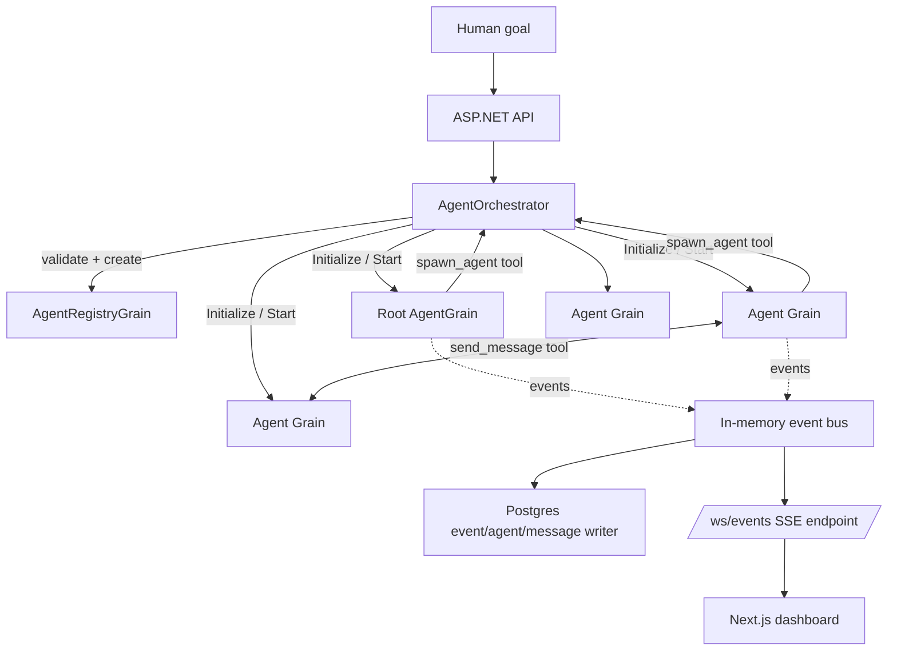
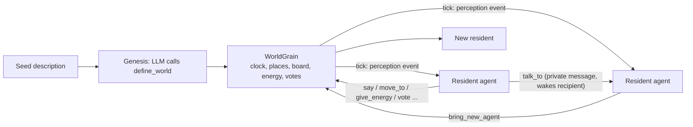
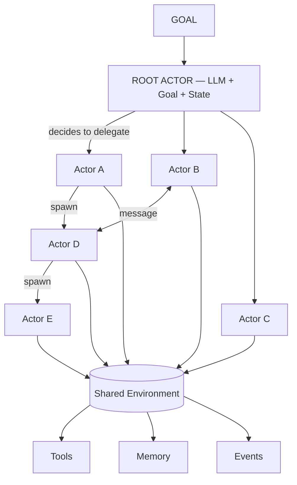

# Aktor Agents

A production-oriented prototype of an **autonomous multi-agent runtime based on the Actor Model**.

You give it a high-level goal — *"Research the feasibility of an AI-powered property management
SaaS"* or *"Add user authentication to this application"* — and it creates a Root Agent that
autonomously decides what work is needed, spawns specialized sub-agents (which can themselves
spawn further sub-agents), lets those agents communicate directly with each other, uses tools,
and eventually aggregates a final result. You watch the whole thing unfold live in a dashboard.
You do not orchestrate the agents by hand.

```
Human Goal → Root Agent → Autonomous Planning → Agent Spawn → Parallel Work
    → Agent-to-Agent Communication → Recursive Agent Spawn → Tool Usage
    → Results → Validation → Final Result
```

The core principle: **the LLM provides reasoning; the actor runtime provides execution,
isolation, messaging, lifecycle, resource management, and governance.** The LLM is never trusted
to enforce a system-level constraint — the runtime always is.

**What the runtime guarantees**, each with the code that enforces it and the test that proves it:
[docs/guarantees.md](docs/guarantees.md).

---

## 1. What's in here

```
/src
  /AgentRuntime               domain: agents, contracts, messaging, tools, LLM abstraction,
                               memory, prompt building — no infrastructure dependencies
  /AgentRuntime.Infrastructure  Postgres persistence, LLM provider implementations, concrete tools
  /AgentRuntime.Api            ASP.NET Core API + co-hosted Orleans silo
  /AgentRuntime.Tests          unit tests (no Orleans cluster needed)
  /AgentRuntime.IntegrationTests  tests against real Orleans grains, scripted LLM, and the real API
                               against a throwaway Postgres container
  /AgentRuntime.Evals          aktor-eval: runs goals N times and reports team size, cost, completion, quality
/evals                        eval scenarios and the committed baseline (docs/evals.md)
/sdk/typescript               TypeScript SDK and the aktor-acp bridge
  /web                        Next.js dashboard (agent graph, live events, analytics, settings)
/docker                       Dockerfiles for the API and the web app
docker-compose.yml
.env.example
```

## 2. Actor Model architecture

Every agent is an **Orleans grain** (`AgentGrain`, behind `IAgentGrain`) — an isolated actor with
its own state, message queue, and single-threaded execution. Agents never touch each other's
state directly:

```
Agent = State + Behavior + Mailbox + Goal + Capabilities

Agent A  --message-->  Orleans messaging  --message-->  Agent B
```

The runtime — not the agent, not the LLM — is authoritative for everything that matters:
spawn limits, budgets, permissions, and lifecycle transitions. This lives in
`AgentOrchestrator` (the "Agent Runtime" from the spec — named to avoid clashing with this
project's own namespace) plus a singleton `AgentRegistryGrain` that tracks the whole tree and
validates every spawn request against `MAX_AGENT_DEPTH` / `MAX_CHILDREN_PER_AGENT` /
`MAX_TOTAL_AGENTS` / `MAX_ACTIVE_AGENTS`.


```mermaid
flowchart TD
    User[Human goal] --> API[ASP.NET API]
    API --> Orchestrator[AgentOrchestrator]
    Orchestrator -->|validate + create| Registry[AgentRegistryGrain]
    Orchestrator -->|Initialize / Start| Root[Root AgentGrain]
    Root -->|spawn_agent tool| Orchestrator
    Orchestrator -->|Initialize / Start| ChildA[Agent Grain]
    Orchestrator -->|Initialize / Start| ChildB[Agent Grain]
    ChildA -->|spawn_agent tool| Orchestrator
    Orchestrator --> Grandchild[Agent Grain]
    ChildA <-->|send_message tool| ChildB
    Root -.->|events| Bus[In-memory event bus]
    ChildA -.->|events| Bus
    Bus --> Persistence[Postgres event/agent/message writer]
    Bus --> SSE[/ws/events SSE endpoint/]
    SSE --> Dashboard[Next.js dashboard]
```

## 3. How an agent works

Each `AgentGrain` runs an event-driven think/act loop (`RunReasoningLoopAsync`), woken by its own
`Start()` call or by a message/event arriving while it's Idle/Waiting — never a busy-polling
thread per agent:

```
while goal not complete:
    build system prompt from current state (IAgentPromptBuilder, composed from sections —
        ROLE / GOAL / CURRENT STATE / TOOLS / RESOURCE LIMITS / MESSAGING RULES /
        SPAWNING RULES / COMPLETION CRITERIA / ENVIRONMENT — never one hard-coded string)
    call the LLM with the full tool catalog the agent is allowed to see
    for each tool call the LLM requests:
        runtime checks the agent is allowed to see this tool AND holds the required permission
        runtime executes it (or rejects it) — the LLM never touches runtime internals directly
    if it called complete_task: transition to Completed and stop
    if budget exhausted / max iterations reached / repeated identical tool call: stop safely
```

Lifecycle states follow an explicit machine (`AgentState.TransitionTo`) —
`Created → Initializing → Idle → Thinking → Executing/Spawning → Waiting → Completed`, with
`Failed`/`Terminated`/`TimedOut` branches. Arbitrary status mutation isn't possible; every
transition is checked against the state machine (or goes through the explicit `ForceStatus`
override reserved for operator-triggered Stop and terminal failure paths).

## 4. How agents spawn agents

`spawn_agent` is a governance tool available to every agent. The LLM decides it wants a
specialist; the runtime decides whether that's allowed:

```
Agent          spawn_agent(role, goal, capabilities)
  → SpawnAgentTool
    → AgentOrchestrator.SpawnAgentAsync
      → AgentRegistryGrain.ValidateSpawnAsync   (depth / children / total / active limits)
      → derive child's budget from the parent's *remaining* budget (never more, never
        self-escalated — CLAUDE.md §24/44)
      → derive child's tools/permissions as an intersection of what it asked for and what
        the parent itself was granted (a child can never see a tool or exercise a permission
        the parent didn't have)
      → create + Initialize + Start the child grain
```

Spawning is genuinely recursive — any agent, at any depth up to `MAX_AGENT_DEPTH` (default 5),
can spawn further agents. The end-to-end tests exercise a 3-level chain (root → research agent →
detail agent) as well as an attempt to exceed `MAX_CHILDREN_PER_AGENT`, which the runtime rejects.

## 5. How agents communicate

`send_message` lets any agent message any other agent directly — no need to route through the
root. Delivery is **asynchronous**: the sender's tool call returns as soon as the message is
appended to the recipient's mailbox, not once the recipient has replied.

This matters architecturally: Orleans grains are non-reentrant (one call executes at a time per
agent). If `SendMessage` synchronously ran the *entire* reasoning turn of the recipient — and
that recipient replied back to the sender before returning — you'd get a structural deadlock the
moment two agents reply to each other (A → B → A, blocked on itself). Instead, `SendMessage`
appends the message and fires a one-way `WakeAndThink()` call to itself; that runs as the grain's
*next* turn, after the current call has already returned. This is the actual mailbox-drop
semantics of an actor system, and it's covered by an integration test
(`AgentsCommunicateDirectly_WithoutGoingThroughRoot`) that specifically exercises a reply cycle.

Every message is treated as untrusted input by the receiver — it never grants permissions,
budget, or authority the receiver didn't already have (CLAUDE.md §51).

## 6. How the LLM interacts with the runtime

```csharp
public interface ILLMProvider
{
    string ProviderName { get; }
    Task<LlmCompletionResponse> CompleteAsync(LlmCompletionRequest request, CancellationToken ct = default);
}
```

`AnthropicProvider` is fully implemented against the Messages API, including structured tool use.
`OpenAIProvider` is a second complete implementation (Chat Completions API), proving the
abstraction holds across vendors without touching `AgentGrain`. `GeminiProvider` is a third
(generateContent API with function calling, thought signatures and cached-token accounting), and
`OllamaProvider` runs local models. All of them pass the same provider contract tests
(`ProviderContractTests`). `HeuristicMockLlmProvider`
needs no API key at all and is what `docker compose up` uses by default — it inspects the
transcript to decide whether to spawn, recurse once, or complete, enough to demonstrate the whole
pipeline (including recursive spawning) with zero configuration.

Tool arguments and results use structured JSON, not free-text parsing — every tool declares a
JSON Schema and the LLM's tool calls are deserialized against it (`ToolJson.Options`, consistently
snake_case, matching the field names in every tool schema and in this document's own examples).

## 7. Running locally

Prerequisites: .NET 10 SDK, Node 20+, Docker (for `docker compose` and for the `shell_exec` tool's
sandboxing).

### Option A — Docker Compose (recommended, zero setup)

```bash
./run.sh          # copies .env.example -> .env on first run, then docker compose up --build
```

- API: http://localhost:5080
- Dashboard: http://localhost:3000

This runs with `LLM_PROVIDER=Mock` by default, so it works immediately with no API key.
Open the dashboard and create an account: the first one owns everything already on the server.
Set `PLATFORM_ADMIN_EMAIL` to that email to be the operator, who can reset the server (see
[docs/platform.md](docs/platform.md)).
`./run.sh -d` runs detached; extra arguments pass through to `docker compose up`.

**Starting over**: `./reset.sh` (operators only; it asks for your email and password, or reads
`AKTOR_EMAIL`/`AKTOR_PASSWORD`), or the "Reset all" button in the dashboard header, deletes every
task, agent, message, event, tool call, and artifact and clears the live agent registry, without
tearing the containers down. See §11.

### Option B — run the pieces yourself

```bash
# Postgres
docker run -d --name aktor-postgres -e POSTGRES_DB=aktor_agents -e POSTGRES_USER=aktor \
  -e POSTGRES_PASSWORD=aktor_dev_password -p 5432:5432 postgres:16-alpine

# API (applies EF Core migrations automatically on startup)
dotnet run --project src/AgentRuntime.Api

# Dashboard
cd src/web
npm install
NEXT_PUBLIC_API_BASE_URL=http://localhost:5080 npm run dev
```

## 8. Configuring an LLM provider

Set these in `.env` (Docker Compose) or `appsettings.Development.json` / environment variables
(running `dotnet run` directly):

```bash
LLM_PROVIDER=Anthropic        # Mock | Anthropic | OpenAI | Gemini | Ollama
LLM_MODEL=claude-sonnet-5     # whatever model id your provider/account supports
LLM_API_KEY=sk-...
```

The API never exposes this key to an agent or a tool call — it's held by the provider
implementation and injected via configuration, per CLAUDE.md §44.

**Or set up several models in the dashboard.** Under **Settings → AI model**, an organization's
Admin adds any number of named models (a provider, a model id, its own API key stored encrypted,
and the prices budgets count in), tests each one, and picks a default. Each task picks its model
when it starts and can switch to another while it runs. The `.env` settings above are always
available as the "Server default" model. See [docs/llm-settings.md](docs/llm-settings.md).

### Local models with Ollama

`LLM_PROVIDER=Ollama` runs every agent on a local model with no API key and no per-token cost
(cost budgets are set to $0 per token automatically). Use a model with **tool calling**:
`qwen2.5:7b`/`14b`, `qwen3:8b`, `llama3.1:8b`, `mistral-nemo`. Very small models (≤3B) tend to
call tools badly.

```bash
ollama pull qwen2.5:7b
# .env
LLM_PROVIDER=Ollama
LLM_MODEL=qwen2.5:7b
LLM_BASE_URL=            # blank = Ollama on the Docker host (host.docker.internal:11434)
```

- The provider uses Ollama's native `/api/chat` and sends `num_ctx` (`LLM_CONTEXT_LENGTH`,
  default 16384); Ollama's own default window would silently truncate agent prompts.
- Thinking is switched off (`"think": false`, `LLM_DISABLE_THINKING=true`), so reasoning models
  such as qwen3 or deepseek-r1 answer directly instead of spending most of each call on a hidden
  reasoning trace. If a model reasons anyway (e.g. gpt-oss, which can't turn it off, or an Ollama
  version older than 0.9, where the provider drops the flag automatically), any `<think>` text is
  discarded and never stored or shown.
- If the API container can't reach Ollama on the host, make Ollama listen on all interfaces
  (`OLLAMA_HOST=0.0.0.0` before `ollama serve`, or set it as a Windows environment variable).
- Or run Ollama inside Compose: `docker compose --profile ollama up -d --build`, set
  `LLM_BASE_URL=http://ollama:11434`, then `docker compose exec ollama ollama pull qwen2.5:7b`.
- Ollama answers one request at a time by default, so simulations switch to a local-model
  profile automatically: 3 residents by default (max 6 at creation, 8 in total), 45 s ticks (min
  20 s), 20 ticks and 30 min. The create form shows these, and the server enforces them
  (`Simulation:LocalModel` in `appsettings.json`). If you have the VRAM, raise
  `OLLAMA_NUM_PARALLEL` and loosen those limits.

## 9. Running the demonstration

With the stack up, submit a goal through the dashboard, or directly:

```bash
curl -X POST http://localhost:5080/api/tasks \
  -H "Content-Type: application/json" \
  -d '{"goal": "Research the feasibility of an AI-powered property management SaaS."}'
```

The task opens as a conversation: your request, a live "working" card while the team works, then
its answer with the files it made. Switch to **Agents** to watch the graph: the Root Agent appears, spawns a Research Agent and a Technical
Architecture Agent, at least one of which recursively spawns its own Detail Agent, all execute
concurrently, and the tree converges back to the Root Agent reporting completion. Click any node
for its goal, budget/usage, granted tools, and structured reasoning trace (tool calls with their
arguments and results — never hidden chain-of-thought, per CLAUDE.md §30).

A second scenario from the spec — *"Add user authentication to this application"* — exercises the
same pipeline; with a real LLM provider configured, expect architecture/security/backend/frontend/
testing-shaped agents rather than the generic research-shaped ones the zero-config Mock provider
produces.

## 10. Inspecting the agent graph, the final result, and artifacts

- **Dashboard** (`src/web`): a sidebar app with dark, light and system themes (system, the default,
  follows the OS; the switch is at the bottom of the sidebar). Its pages:
  - **Tasks**: a ChatGPT/Claude-style composer that takes a goal and files, with a model picker and
    options for budget (cost, tokens, minutes, sub-agents), team shape (max agents, fan-out,
    spawner roles, goal type), delivery (webhook, secret, correlation id) and a cost estimate. Each
    task is then a **conversation** (follow-ups, attachments, file previews, continuing with more
    budget; see [docs/tasks.md](docs/tasks.md)). Its **Agents** view shows the live React Flow
    graph colour-coded by status, a switch to move the team to another model, the run's full
    activity (history plus live events via `/ws/events`), the result, and a details panel per agent
    (goal, budget and usage, granted tools, structured reasoning trace).
  - **Workspaces** and **Templates**: reusable pipelines on a resizable canvas (edit in plain
    language, or by hand: drag stages, draw connections, drop in new agents), run history with
    live stage status, their triggers, integrations, safety policy (including team shape) and
    approvals.
  - **Approvals** that are hard to miss: a bell with the count in the sidebar and the tab title,
    a toast with Approve and Reject, optional desktop notifications, a banner in the workspace and
    a marker on the waiting agent ([docs/safety.md](docs/safety.md#approvals)).
  - **@mentions** in every text box: agents (stages), models, providers and skills, explained to
    the model that reads the text ([docs/workspaces.md](docs/workspaces.md#mentions)).
  - **Skills**: write a skill in the browser or upload a `SKILL.md` or `.zip`; enable, edit,
    download or delete it. Skills belong to the whole organization or to one workspace, whose agents
    alone use them ([docs/skills.md](docs/skills.md)).
  - **Shared memory**: search what agents saved with `write_memory`, and add facts or whole files
    (PDF, Word, Excel, PowerPoint, CSV, text) for them, for the whole organization or one workspace
    ([docs/memory.md](docs/memory.md#organization-and-workspace-knowledge)).
  - **Analytics**, for tasks and for workspaces: spend, tokens, runs and durations over time; what
    consumes the most by agent role; spend and response time by model; spend by source or by
    workspace; tool timings and failures; triggers and approvals; the most expensive and slowest
    runs. Filter by date range, model, source, status, goal or workspace; click a chart to drill in
    ([docs/analytics.md](docs/analytics.md)).
  - **Run history**: every run with its source (API, MCP, A2A, ACP, replay), status, agents and
    cost, with links to its graph and its journal (step through, replay, fork, diff).
  - **Simulation**, **Integrations & API** (key creation and copy-paste MCP, A2A, ACP and REST
    snippets), and **Settings** (organization, members, AI models, API keys, usage and billing,
    your account).
- **Result tab**: once the root agent finishes (Completed/Failed/Terminated/TimedOut), the run's
  **Result** tab shows the aggregated summary,
  per-agent findings, unresolved items, run metrics (tool calls / tokens / cost), and download
  links for any artifact an agent wrote via `filesystem_write` (the zero-config Mock provider has
  the root agent write a `final-report.md` consolidating its sub-agents' findings, so this is
  populated even with no LLM API key configured). Files appear as agents write them, without
  reloading the page.
- **Conversations, files and documents** ([docs/tasks.md](docs/tasks.md)):
  - **Follow-ups** reopen a finished task with its whole history and a new round of budget; a
    running task folds them into its work.
  - **Continue**: when an answer stops partway (out of budget or time), the chat shows what was
    left and lets you set a bigger budget to finish it.
  - **Attachments** of any type, on the first message or any follow-up. Agents read PDF, Word,
    Excel and PowerPoint files as text.
  - **Documents**: agents write Word, PDF, Excel, PowerPoint, CSV and Markdown files with
    `create_document`.
  - **Previews**: any file opens in place (documents rendered, sheets as grids, decks as slides,
    PDFs and images as themselves) from the chat, the Result tab or a workspace's files.
  - **MCP servers for a task**: connect them when you start it (Options) or from its **Tools**
    button; its agents use their tools from their next step.
- **REST API**:
  - `GET /api/tasks/{id}` — status + one-line summary
  - `POST /api/tasks/{id}/messages` (a follow-up), `POST /api/tasks/{id}/continue` (carry on with a
    new budget), `GET /api/tasks/{id}/chat` (the conversation), uploads and previews: see
    [docs/tasks.md](docs/tasks.md#api).
  - `GET /api/tasks/{id}/result` — the aggregated `TaskResult` (CLAUDE.md §52): `{ready, result: {status, summary, findings, artifacts, participating_agents, unresolved_items, metrics}}`. `ready: false` until the root completes.
  - `GET /api/tasks/{id}/artifacts` — list artifacts produced during the task
  - `GET /api/tasks/{id}/artifacts/{artifactId}/content` — download an artifact's file content
  - `GET /api/agents`, `GET /api/agents/{id}`, `GET /api/agents/{id}/children`,
    `GET /api/agents/{id}/messages`, `GET /api/agents/{id}/tool-calls`, `GET /api/tasks/{id}/events`

  Full list in `AgentRuntime.Api/Controllers`.
- **Postgres** is the durable source of history (`Agents`, `Messages`, `Events`, `ToolCalls`,
  `Tasks`, `Artifacts`, `MemoryEntries`) — the Orleans grain state is optimized for active
  execution, not queried directly for history (CLAUDE.md §39).

### Starting over

`./reset.sh` (prompts for confirmation; `./reset.sh -y` skips it) or the "Reset all" button in the
dashboard header calls `POST /api/admin/reset`, which deletes every task/agent/message/event/
tool-call/artifact row, clears the in-memory agent registry, and removes files from the workspace
volume — all without restarting the containers. Existing agent grain activations (if any were
somehow still mid-turn) are simply left to idle out; nothing references their old ids once the
registry and history are both cleared.

## 10b. World simulation: agents living in a shared environment

Besides goal-driven tasks, the runtime can host an open-ended **world** of autonomous residents
that plan, talk and act on their own. Open **World simulation →** in the dashboard header
(`/simulation`), describe a setting, and press *Create world and start*.


```mermaid
flowchart LR
    Seed[Seed description] --> Genesis[Genesis: LLM calls define_world]
    Genesis --> World[WorldGrain<br/>clock, places, board, energy, votes]
    World -- "tick: perception event" --> R1[Resident agent]
    World -- "tick: perception event" --> R2[Resident agent]
    R1 -- "say / move_to / give_energy / vote ..." --> World
    R1 -- "talk_to (private message, wakes recipient)" --> R2
    R2 -- "bring_new_agent" --> World
    World --> R3[New resident]
```

- **Genesis.** An LLM turns your description into locations and residents (persona, drives,
  relationships) through a single structured `define_world` tool call.
- **Residents are ordinary agent grains** with a world id. They get only world tools (no
  filesystem, shell, network or `spawn_agent`), a per-resident spending cap, and short turns: each
  tick's perception wakes them, they take a few actions, then call `end_turn` with a one-line plan.
  Their LLM calls see only a sliding window of recent history (older memories go in
  `note_to_self`), so cost per turn stays flat instead of growing over the world's lifetime.
- **World actions** (all validated and charged by the `WorldGrain`, never by the LLM):
  `look_around`, `move_to`, `say` (heard at your location), `talk_to` (private, wakes the recipient
  at once), `post_to_board`, `give_energy`, `propose_removal`, `vote`, `bring_new_agent`,
  `note_to_self`, `leave_world`, `end_turn`.
- **Energy.** Every action costs energy; residents regain a little each tick. At 0 they go dormant
  (their agent is paused, spending nothing) until another resident gives them energy.
- **Removal is by vote.** A proposal needs a strict majority of the residents who were eligible
  when it opened (minimum 3 voters) within 3 ticks. Nobody can remove anyone alone.
- **Cost bound.** A world always ends at its tick limit or time limit, whichever comes first (both
  clamped server-side), and ending it retires every resident. Pausing pauses every agent too.
- **Insight.** The map shows who is where, speech bubbles, private-message and energy-gift arrows,
  energy bars and lineage. The feed has *Conversations* (public and private speech, filterable),
  *Minds* (each resident's stated plans and notes; structured summaries, never hidden
  chain-of-thought), *Board*, *Votes* and *Raw events*. Clicking a resident shows its persona,
  drives, notes, usage, and its full tool-call trace and messages.
- **Mock provider.** With `LLM_PROVIDER=Mock` worlds run for free with randomised stand-in
  behaviour, which is handy for trying the UI. Real personalities need a real provider.
- **API:** `POST /api/worlds`, `GET /api/worlds`, `GET /api/worlds/{id}`,
  `POST /api/worlds/{id}/pause|resume|end`. The live SSE feed is `/ws/events?taskId={worldId}`.
  Snapshots are archived to the `Worlds` table every tick, so a world remains inspectable after a
  restart. Rules live in the `Simulation` section of `appsettings.json`.

## 10b-2. Workspaces: reusable agent pipelines

Open **Workspaces** in the dashboard (`/workspaces`) and describe a job you want done again and
again: market research reports, support-ticket triage, code reviews, incident investigation, and so
on. Nothing is domain-specific; your description, stages and connections decide what a workspace
does.

- A **pipeline** of agents is drafted from your description: stages, each an agent with a role,
  instructions and tools, connected into a graph (parallel branches merge where a stage takes
  several inputs).
- **Change it in plain language** ("add a fact checker after Research", "use `@claude-fast` for
  `@triage`") with a preview before it applies, or **by hand on the canvas**, which needs no
  model: drag stages around, drag from a stage's dot to another to connect them (or to empty
  space to add an agent there), drop in **New agent**, + on any connection, × on any stage or
  connection. Every change is a version you can restore; moving stages isn't a new version.
- **Mention** stages, models, providers and skills with `@` in any text box, so a weaker model
  doesn't have to guess what you mean.
- **Each stage can run on its own model**, and shared knowledge its agents save stays in the
  workspace unless they share it with the whole organization.
- **Run it** with an input, or let **triggers** run it: schedules (intervals or cron), webhooks
  (e.g. from Shopify) and watches (checks in code, no model call until something matches).
- Inside a stage the agent is autonomous within limits: tools, helpers through a plan, quick
  questions to other stages. The runtime starts stages when their inputs are done, retries
  failures, and enforces a time limit per run and one **daily budget** per workspace.
- Every run is a task with its own agent graph, files, events and result; results reach you in
  the chat and on your channels. The **Live agents** canvas shows the agents of recent runs at
  work; show only running runs, or hide and show any run.
- **Templates** start you from real-world pipelines: incident response, support triage, market
  research, pull request review, lead research, content production, weekly competitive
  intelligence, contract review and candidate screening.

See [docs/workspaces.md](docs/workspaces.md) and [docs/templates.md](docs/templates.md).

## 10b-3. Integrations and plugins

In a workspace's **Integrations** tab you can connect services, and you can add your own plugins.
- **What you can connect:** MCP servers, REST APIs (e.g. your Shopify store's Admin API), Slack,
  SMS (Twilio), email (SMTP) and Telegram.
- **Tools:** agents get a connection's tools (`shop__get`, `crm__lookup_customer`).
- **Notifications:** run results, watch alerts and approvals reach you on your channels by urgency.
- **Commands back:** you can reply by SMS or Telegram to start a run or decide an approval.
- **Secrets** are encrypted in a vault and never reach agents.
- **Your own plugins:** build against `AgentRuntime.Plugins.Sdk` and drop the DLL into `./plugins`.

See [docs/plugins.md](docs/plugins.md) and [samples/ExamplePlugin](samples/ExamplePlugin).

## 10b-4. Token efficiency

Long-running agents are built to cost nothing while nothing is happening:
- **Watches.** Recurring checks such as "stock < 10" are evaluated by the runtime with no LLM call,
  and only newly matching items are reported.
- **Prompt caching.** The prompt has a stable prefix, with Anthropic cache breakpoints.
- **Model routing.** A cheaper `LLM_FAST_MODEL` handles routine event handling.
- **Context compaction.** Long histories are summarized once instead of being resent every call.

See [docs/efficiency.md](docs/efficiency.md).

## 10b-5. Safety: approvals and the audit log

Each workspace has a safety policy that the runtime enforces before any tool runs. The LLM can't
see around it or change it.
- **Organization-wide rules.** Admins set rules, a minimum autonomy level and team limits once
  (Settings → Safety policy); they apply to every workspace and task. A workspace can add to them
  but never loosen them: the stricter answer wins.
- **Autonomy levels.**
  - `Autonomous` is the default.
  - `SemiAutonomous` asks you before actions that can't be undone or safely repeated, such as
    sending, paying or deleting.
  - `Supervised` asks before every external write.
- **Rules** match tool names (`billing__*`, `*__send_sms`) and can allow, block or ask, whatever
  the level.
- **Approvals park the agent durably.** Parked agents survive restarts, and you can still stop
  them. You're told wherever you are in the dashboard (a bell with the count, a toast, a
  workspace banner, a marker on the agent, optional desktop notifications) and on your channels.
  Decide from any of those, the Safety tab, the API, or by replying `approve A3` / `reject A3 too
  expensive` in the chat or over SMS or Telegram.
- **The audit log** records every tool call, approval, policy change and command. It's
  hash-chained per workspace, so an edited or deleted record is detected.

See [docs/safety.md](docs/safety.md).

## 10b-6. The platform: organizations, API keys, SDK and billing

One server hosts many organizations, and the runtime (not only the API) keeps them apart:
- **Isolation.** Agents inherit their organization and can only message, discover or share
  memory with agents of the same one. Each organization gets its own SQL scratch schema.
- **Access.** People sign in with email and password and have a role: Viewer, Member, Admin or
  Owner. Scripts use API keys (`Authorization: Bearer ak_…`) and the
  [TypeScript SDK](sdk/typescript/README.md). The API is described at `/openapi/v1.json`.
- **Plans and usage.** Plans set monthly token and spend quotas plus workspace, agent and member
  limits. Usage is metered per organization. An agent over quota pauses mid-turn and carries on
  when the quota renews or the plan is upgraded (optionally through Stripe Checkout).

Locally, sign in as `admin` / `admin`: Docker Compose and the Development environment create that
account at startup (turn it off with `LOCAL_ADMIN_USERNAME=`). Visitors who aren't signed in land
on the product page at `/welcome`. Set `AUTH_MODE=disabled` for a single-user machine. See [docs/platform.md](docs/platform.md).

## 10b-7. Calling Aktor from other tools: MCP, A2A, ACP

Aktor is the governed runtime underneath other tools. n8n, Claude Code, CrewAI, OpenClaw and
editors hand it a goal; a team works on it under the server's budgets; the result comes back.
- **MCP server** at `/mcp`: `run_goal`, `get_task_status` (long poll), `get_task_result`,
  `cancel_task`, `list_agents`.
- **A2A agent** (`/.well-known/agent-card.json`, `/a2a`), speaking protocol 1.0 and 0.3.
- **ACP agent** (`/acp`, plus the `aktor-acp` stdio bridge) for OpenClaw/acpx and Zed.
- **Finding out a task finished:** poll, long-poll, a signed completion webhook, or MCP progress
  notifications.
- **No bypass:** every way in uses the same API keys, task service, budget ceiling, quotas and
  tenant isolation as `POST /api/tasks`. Every result carries a `correlation_id` and a
  `dashboard_url`.

See [docs/integrations.md](docs/integrations.md).

## 10b-8. Cost preview, team shape, memory, replay and evals

- **Cost and team preview.** One planning call before a run shows the likely team and a token,
  dollar and time range, calibrated on past runs. The dashboard asks before starting anything
  costly, shows spend against budget per branch of the tree, and records estimate vs actual.
  ([docs/preview.md](docs/preview.md))
- **Team-shape policies** are enforced at every spawn: max agents (also by goal type), which roles
  may spawn, fan-out per level, and no duplicate roles. Policies come from the server, the task or
  the workspace, and only ever tighten. ([docs/safety.md](docs/safety.md#team-shape))
- **Semantic memory** (pgvector + an Ollama or OpenAI embedding provider): hybrid search by meaning,
  words and recency, still tenant-scoped. Without embeddings it falls back to keywords.
  ([docs/memory.md](docs/memory.md))
- **Replay from the step journal.** Re-run a finished task from its recorded decisions with no
  model or external calls, or fork it live from any step. Step through it and diff two runs in the
  dashboard. ([docs/replay.md](docs/replay.md))
- **Evals.** `aktor-eval` measures team size, cost, duration, completion and judged quality across
  models and prompt versions. CI checks the demo scenarios against a committed baseline.
  ([docs/evals.md](docs/evals.md))

## 10b-8b. Skills

Teach agents how your organization works. **Skills** in the sidebar: write a skill (name, description,
instructions, optional files) or upload a `SKILL.md` / `.zip` in the Agent Skills format. Every
agent sees each skill's name and description and loads the instructions with `load_skill` when its
work matches. Skills are per organization and never grant permissions. See
[docs/skills.md](docs/skills.md).

## 10b-8c. Choosing models

Each organization sets up the models it wants under **Settings → AI model**: Anthropic, OpenAI or
any OpenAI-compatible service, Gemini or Ollama, each with its own key and prices, tested before
saving, one of them the default. A task picks its model when it starts, can **switch to another
while it runs** (the whole team moves from each agent's next step), and can be forked onto another
model after it finishes to compare them from the same start. Agents can also give different models
to the agents they spawn, so a goal can say it in plain language: "use Careful for the analysis and
Quick for collecting prices". Keys are encrypted, never returned, and never sent to an address they
weren't saved for. See [docs/llm-settings.md](docs/llm-settings.md).

## 10b-8d. Analytics

**Analytics** shows where tokens and money go and what takes long, for tasks and for workspaces:
trends per hour or day, consumption by agent role, spend and response time **by model** (which one
is cheaper or faster), spend by source or by workspace, tool timings and failures, triggers and
approvals, run durations, and the most expensive and slowest runs, with changes against the
previous period. Filters (date range, model, source, status, goal, workspace) stay in the URL, so a
view can be shared. See [docs/analytics.md](docs/analytics.md).

## 10b-9. Flagship: incident response

The **Incident response** workspace template:
- an alert on its webhook wakes a team that investigates logs, metrics and recent deploys in
  parallel;
- the team writes `incident-report.md`;
- it proposes a rollback that waits for your approval (`SemiAutonomous`).

Every step is audited. With the Mock provider it runs as a scripted demo (**Simulate alert**); with
a real model it runs live. See [docs/incident-response.md](docs/incident-response.md).

## 10c. Durable execution

Agents survive crashes, restarts and outages, and resume exactly where they stopped:
- Every step of an agent's turn is saved before the next one runs.
- Every input goes through a durable mailbox.
- Durable reminders re-activate interrupted work without anyone asking.
- Tool calls cut off by a crash are re-run with the same idempotency key when that's safe.
- A non-idempotent call (a payment, a raw POST) is never blindly repeated: the agent is told its
  outcome is unknown.

State lives in Postgres through Orleans' ADO.NET storage (installed automatically). See
[docs/durability.md](docs/durability.md) for the exact guarantees and limits, and
`CrashRecoveryTests` for the kill-and-resume tests.

## 11. Resource and security controls

- **Spawn limits**: `MAX_AGENT_DEPTH=5`, `MAX_CHILDREN_PER_AGENT=10`, `MAX_TOTAL_AGENTS=100`,
  `MAX_ACTIVE_AGENTS=50` (`RuntimeLimits` in `appsettings.json`), enforced by
  `AgentRegistryGrain` — not the LLM.
- **Budgets** (tokens, tool calls, children, cost, duration) propagate from parent to child and
  can only ever be narrowed, never expanded (`ResourceBudget.DeriveChildBudget`). A task gets more
  budget only when a person follows up or continues it: one round at a time, capped by
  `TaskBudgetCeiling`, never by an agent ([docs/tasks.md](docs/tasks.md#continuing-with-more-budget)).
- **Uploads** (attachments, knowledge files) are capped per file and per upload
  (`ATTACHMENT_MAX_BYTES`, `ATTACHMENT_MAX_FILES`), stored in the task's sandboxed workspace, and
  previewed without running anything: HTML shows in a sandbox with scripts off.
- **Loop guards**: max reasoning iterations per turn, max identical-tool-call repeats, max
  messages per task.
- **Permissions** (`ToolPermission` flags: filesystem, shell, network, git, database, spawn,
  message) are runtime-enforced per tool call; a child can never be granted a tool or permission
  its parent didn't have.
- **Execution isolation**: `shell_exec` runs inside an ephemeral, network-disabled, resource-capped
  Docker container (`--network none`, memory/CPU limits, timeout) rather than on the host.
  `database_query` is restricted to `agent_`-prefixed scratch tables — it can never touch the
  runtime's own history tables.
- **Credentials never reach an agent**: the database connection string, search API key, and LLM
  API key all live in server-side configuration; tools accept only the parameters an agent should
  see (a URL, a SQL string, a search query) and the runtime supplies the credential.
- **Organization model keys** (Settings → AI model) are encrypted with the secrets master key,
  only Admins can set them, and the API never returns them. A key is used only for the provider
  and address it was saved with, and the server's own key only for the server's provider at the
  server's address. On a shared server, set
  `LLM_ALLOW_PRIVATE_BASE_URLS=false` so organization admins can't point a provider at your
  internal network ([docs/llm-settings.md](docs/llm-settings.md)).

## 12. Architecture diagram


```mermaid
flowchart TD
    Goal[GOAL] --> RootActor[ROOT ACTOR — LLM + Goal + State]
    RootActor -->|decides to delegate| A[Actor A]
    RootActor --> B[Actor B]
    RootActor --> C[Actor C]
    A -->|spawn| D[Actor D]
    B <-->|message| D
    D -->|spawn| E[Actor E]
    A --> Env[(Shared Environment)]
    B --> Env
    C --> Env
    D --> Env
    E --> Env
    Env --> Tools[Tools]
    Env --> Memory[Memory]
    Env --> Events[Events]
```

## 13. Example agent interaction

```
Root Agent (root-a1b2c3)
  decision: "This goal needs both market research and a technical assessment."
  action:   spawn_agent(role="Research Agent", goal="Research the market and competitors")
  action:   spawn_agent(role="Technical Architecture Agent", goal="Propose an architecture")

Research Agent (agent-d4e5f6)
  decision: "I should verify demand data before drawing conclusions."
  action:   spawn_agent(role="Data Collection Agent", goal="Gather supporting market data")
  ...
  action:   complete_task(status="completed", summary="Market is viable; see findings.")

Technical Architecture Agent (agent-a7b8c9)
  action:   send_message(to=agent-d4e5f6, type=InformationRequest,
                          payload="What data model did you assume?")
  # delivered asynchronously; Research Agent wakes, replies, Technical Architecture Agent
  # wakes on the reply and continues
  action:   complete_task(status="completed", summary="Architecture proposal attached.")

Root Agent
  action:   find_agents()          # confirms children have completed
  action:   complete_task(status="completed", summary="Feasibility analysis complete.",
                           artifacts=[], evidence=[])
```

## 14. Testing

```bash
dotnet test src/AgentRuntime.Tests               # unit tests — no Orleans cluster
dotnet test src/AgentRuntime.IntegrationTests    # real Orleans grains + a scripted LLM
```

Integration tests cover, among others:
- root spawning a child, a child recursively spawning a grandchild, and two agents messaging each
  other directly (including a reply cycle);
- several children completing concurrently;
- tool-call budget exhaustion forcing a clean stop;
- a spawn request beyond `MAX_CHILDREN_PER_AGENT` being rejected by the runtime rather than the LLM;
- crash recovery, approvals and tenancy;
- the MCP, A2A and ACP endpoints, previews, vector memory and the incident-response demo, against
  the real API and a throwaway pgvector container. These need Docker and are skipped without it.

```bash
# The eval harness on the demo scenarios, compared with the committed baseline:
dotnet run --project src/AgentRuntime.Evals -- --spec evals/demo-scenarios.json --out evals/reports/latest \
    --baseline evals/baseline/report.json --set Llm:Provider=Mock
```

## 15. Known simplifications

This is a prototype, and a few things are deliberately simplified rather than fully productionized:

- **Single silo by default.** Agent state, mailboxes and reminders are durable in Postgres (see
  [docs/durability.md](docs/durability.md)), so a restart or crash resumes in-flight work. For
  failover across machines, set `Silo:Clustering=AdoNet` to run several silos.
- **`POST /api/admin/reset` has no auth** — anyone who can reach the API can wipe all data. Fine
  for a local prototype; a shared deployment should gate this behind an operator role.
- **Agents read text, not pixels.** Attached images are stored and previewed but not passed to the
  models; legacy `.doc`/`.xls`/`.ppt` files aren't read. Generated decks are titles and bullets
  ([docs/tasks.md](docs/tasks.md#limits)).
