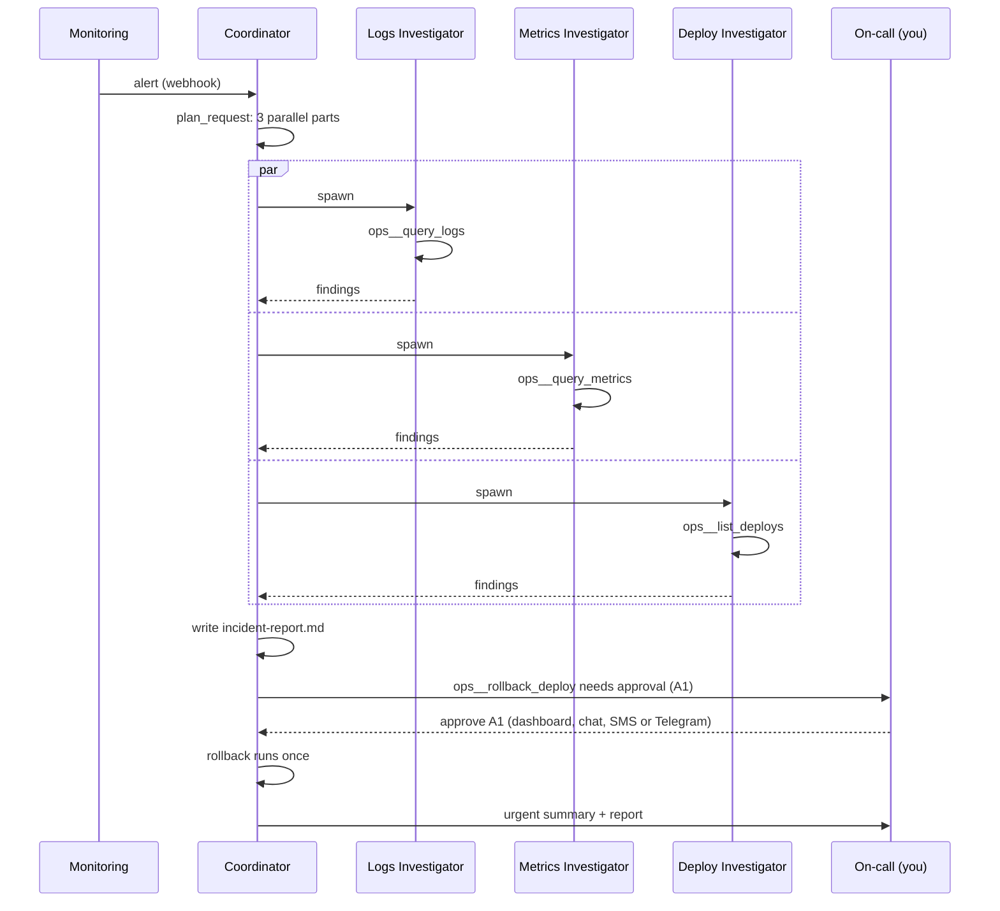

# Flagship: incident response

The **Incident response** workspace template brings together what makes Aktor different:
- open-ended investigation by a team that forms per incident;
- long-running monitoring that survives restarts;
- fixes that wait for a human, under a runtime-enforced policy;
- a tamper-evident record of all of it, shared by everyone in the organization.



## Trying it

1. **Workspaces → New workspace → Start from a template → Incident response → Create.** Leave
   "Connect the simulated production system" on.
2. Press **Simulate alert** in the workspace header, or POST to the webhook URL the template
   created, as your monitoring would:

   ```bash
   curl -X POST "$AKTOR_URL/api/hooks/<workspace>/<trigger>/<secret>" -H 'Content-Type: application/json' \
     -d '{"alert":"HighErrorRate","service":"checkout-service","severity":"critical","value":"18.4%"}'
   ```
3. Watch the team view:
   - three investigators start, query the simulated system and report;
   - `incident-report.md` appears under **Files**;
   - a rollback approval (`A1`) appears in the chat and the **Safety** tab.
4. **Approve** (or reply `approve A1`). The rollback runs once, and the coordinator posts an urgent
   summary. **Reject** instead, and nothing changes in production; the summary says so.
5. The **Safety → Audit** log shows every query, the approval, and the rollback, and the chain
   verifies.

With `LLM_PROVIDER=Mock` the investigation follows a script (`MockIncidentBehavior`), so the demo
runs with no API key. With a real model, the same template runs live: the coordinator follows the
instructions in the workspace goal, and nothing about the flow is hard-coded.

## What the template sets up

| | |
|---|---|
| **Goal** | Plain instructions for the coordinator: plan; start one investigator each for logs, metrics and deploys; write `incident-report.md`; propose a rollback only with evidence; notify the user urgently. Edit them like any workspace goal. |
| **Safety** | `SemiAutonomous`, so writes that can't be undone need approval. Rules: `*__rollback*` → ask; `shell_exec` → deny. Approvals expire after 4 hours. |
| **Team shape** | At most 6 live agents; the coordinator may run 3 investigators at once; investigators can't spawn (`max_fan_out_by_depth: [3, 0]`, counting live agents only, since a workspace lives for months). |
| **Webhook** | "Incoming alerts", targeting the coordinator. Its secret URL is returned once, when the workspace is created. |
| **Connection** | `ops` (plugin `demo-ops`): a simulated checkout-service incident. `query_logs`, `query_metrics` and `list_deploys` are read-only; `rollback_deploy` is non-idempotent. |
| **Budget** | 2M tokens / $10 per day for the whole workspace. |

## Going to production

Replace the demo connection with real ones, keeping the tool names or editing the goal:
- **Logs and metrics:** an HTTP API connection to Datadog, Grafana Loki or Prometheus, or an MCP
  server. Expose read-only `query_logs` and `query_metrics`.
- **Deploys and rollbacks:** your CD system or GitHub deployments. Mark the rollback tool
  non-idempotent so the policy asks first.
- **Alerts:** point PagerDuty, Alertmanager or Datadog webhooks at the template's webhook URL.
- **On-call:** connect Slack, SMS or Telegram so the urgent summary and the approval reach you, and
  reply `approve A1` from your phone.

## API

| Method | Path | |
|---|---|---|
| `GET` | `/api/workspace-templates` | The templates and what each sets up |
| `POST` | `/api/workspaces/from-template` | `{template, name?, use_demo_system?}` → `{workspace_id, connections, webhooks: [{name, path}]}` |
| `POST` | `/api/workspaces/{id}/simulate-alert` | `{payload?}`: delivers through the workspace's own webhook, with the same limits and audit as a real one |

## Tests

`IncidentResponseTests` (real API, Postgres container, Mock provider):
- An alert on the real webhook starts the three investigators and writes the report. The rollback
  waits for approval and runs nothing before it. Once approved, it runs exactly once, the user is
  told, and the audit log has every step and verifies.
- A rejected rollback never runs, and simulate-alert works.
