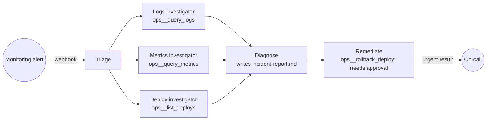
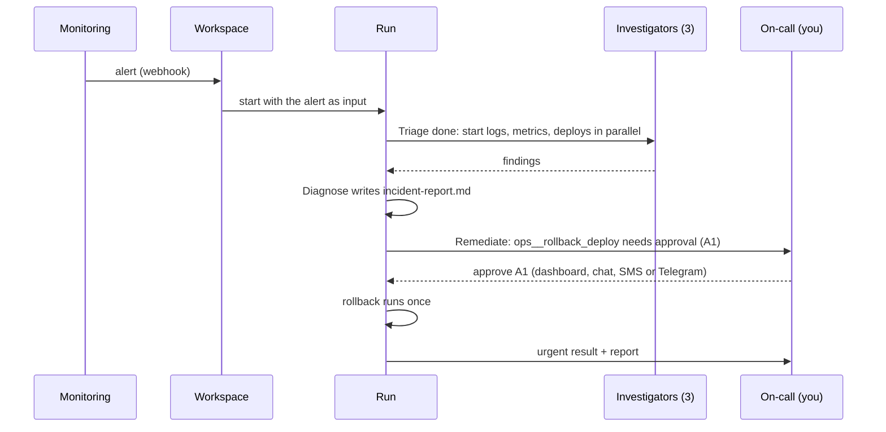

# Flagship: incident response

The **Incident response** workspace template brings together what makes Aktor different:
- an investigation pipeline that every alert runs, with parallel branches that merge;
- each stage an agent that decides how to do its part, within runtime-enforced limits;
- fixes that wait for a human, under a runtime-enforced policy;
- a tamper-evident record of all of it, shared by everyone in the organization.





## Trying it

1. **Workspaces → New workspace → Start from a template → Incident response → Create.** Leave
   "Connect the simulated production system" on.
2. Press **Simulate alert** in the workspace header, or POST to the webhook URL the template
   created, as your monitoring would:

   ```bash
   curl -X POST "$AKTOR_URL/api/hooks/<workspace>/<trigger>/<secret>" -H 'Content-Type: application/json' \
     -d '{"alert":"HighErrorRate","service":"checkout-service","severity":"critical","value":"18.4%"}'
   ```
3. Watch the run on the canvas:
   - Triage reads the alert, then the three investigators work at the same time;
   - Diagnose writes `incident-report.md` (it appears under **Files**, in `run-1/`);
   - Remediate's rollback approval (`A1`) appears in the chat and the **Safety** tab.
4. **Approve** (or reply `approve A1`). The rollback runs once, and the run's urgent result is
   posted (and forwarded to connected channels). **Reject** instead, and nothing changes in
   production; the result says so.
5. The **Safety → Audit** log shows every query, the approval, and the rollback, and the chain
   verifies.

With `LLM_PROVIDER=Mock` each stage follows a script (`MockIncidentBehavior`), so the demo runs with
no API key. With a real model, the same pipeline runs live: each stage's agent follows its
instructions, and you can change any stage, or add one ("add a customer-impact estimate in
parallel with the investigators"), like any pipeline.

## What the template sets up

| | |
|---|---|
| **Pipeline** | Triage → Logs, Metrics and Deploy investigators (in parallel; each keeps going if one fails) → Diagnose → Remediate (no retries: a rollback isn't something to try twice). Runs may take 4 hours, so a person has time to approve; 2 at once; results are urgent. |
| **Safety** | `SemiAutonomous`, so writes that can't be undone need approval. Rules: `*__rollback*` → ask; `shell_exec` → deny. Approvals expire after 4 hours. |
| **Webhook** | "Incoming alerts": each delivery starts a run with the alert as its input. Its secret URL is returned once, when the workspace is created. |
| **Connection** | `ops` (plugin `demo-ops`): a simulated checkout-service incident. `query_logs`, `query_metrics` and `list_deploys` are read-only; `rollback_deploy` is non-idempotent. |
| **Budget** | 2M tokens / $10 per day for the whole workspace. |

## Going to production

Replace the demo connection with real ones, keeping the tool names or editing the stages:
- **Logs and metrics:** an HTTP API connection to Datadog, Grafana Loki or Prometheus, or an MCP
  server. Expose read-only `query_logs` and `query_metrics`.
- **Deploys and rollbacks:** your CD system or GitHub deployments. Mark the rollback tool
  non-idempotent so the policy asks first.
- **Alerts:** point PagerDuty, Alertmanager or Datadog webhooks at the template's webhook URL.
- **On-call:** connect Slack, SMS or Telegram so the urgent result and the approval reach you, and
  reply `approve A1` from your phone.

## API

| Method | Path | |
|---|---|---|
| `GET` | `/api/workspace-templates` | The templates and what each sets up |
| `POST` | `/api/workspaces/from-template` | `{template, name?, use_demo_system?}` → `{workspace_id, connections, webhooks: [{name, path}]}` |
| `POST` | `/api/workspaces/{id}/simulate-alert` | `{payload?}`: delivers through the workspace's own webhook, with the same limits and audit as a real one |

## Tests

`IncidentResponseTests` (real API, Postgres container, Mock provider):
- An alert on the real webhook starts one run: triage and the three investigators finish and the
  report is written. The rollback waits for approval and runs nothing before it. Once approved, it
  runs exactly once, the result reaches the user, and the audit log has every step and verifies.
- A rejected rollback never runs, and simulate-alert works.
