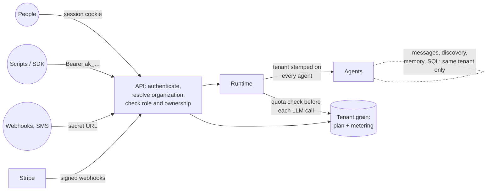

# The platform: organizations, access, API and billing

One server hosts many **organizations** (tenants). Each one has its own members, API keys,
workspaces, tasks, worlds, agents, memory, scratch database and plan, and none of them can see
another's. The same build runs self-hosted for one team or as a multi-tenant service.



## Organizations and isolation

The tenant is stamped by the runtime and inherited, never chosen by an agent.
- An organization's id is set on every workspace, task and world when it's created, from whoever
  made the request.
- Every agent those create, and every agent *they* create, inherits the same id.
- Nothing in a prompt, message or tool call can change it.

**What the runtime enforces**, beyond the API checks:

| Surface | Isolation |
|---|---|
| `send_message` | Only to agents of the same organization. Another tenant's agent is reported as "no such agent". |
| `find_agents`, `get_agent_status`, `list_children` | Filtered by organization. |
| Shared memory (`write_memory` with `shared`, `search_knowledge`, `read_memory`) | Shared within an organization only. |
| `database_query` | Each organization gets its own Postgres role and schema (`agent_scratch_t_…`), provisioned on first use. Other tenants' schemas are owned by their roles and never granted. |
| Agent limits (`MaxTotalAgents`, `MaxActiveAgents`) | Counted per organization, so one tenant filling up can't block another. The plan's limit applies on top. |
| Events | Every event carries its organization. The live stream and the event history only return the caller's. |
| Files | Each task and workspace has its own sandbox directory, and its ids are unique. |

**The API** answers `404` for any id outside the caller's organization, so other tenants' ids are
indistinguishable from ids that don't exist.

**Existing data.** Everything created before multi-tenancy belongs to the `default` organization,
and the first account created on a server takes it over.

## People and roles

| Role | Can |
|---|---|
| Viewer | See everything: workspaces, agents, events, approvals, the audit log, usage. |
| Member | Also create workspaces, tasks and worlds, instruct agents, add triggers, and decide approvals. |
| Admin | Also manage connections, safety policies, workspace budgets, members, invitations and API keys. |
| Owner | Also manage billing and who is an owner. An organization always keeps at least one owner. |

**Accounts** are email and password.
- Passwords are hashed with PBKDF2-SHA256 at 600,000 iterations.
- Sign-in and sign-up are rate limited per client address.
- An unknown email takes as long to reject as a wrong password.

**Sessions** are random tokens in an `HttpOnly`, `SameSite=Lax` cookie (`Secure` over HTTPS).
- Only their SHA-256 is stored.
- They slide for `Auth:SessionDays` (30 by default).
- Changing a password signs out every other browser. Removing a member ends their sessions in
  that organization.

**Invitations** are one-time links, valid for `Auth:InvitationDays` (7 by default).
- A link works only for the email it was sent to, and only while the plan has seats.
- Admins can't invite anyone with more access than they have themselves.

**Self-hosting alone?** `AUTH_MODE=disabled` skips sign-in entirely and makes everyone the owner of
the default organization. Use it only on a machine nobody else can reach.

## API keys and the SDK

Create a key under **Settings → API keys**, then send it as `Authorization: Bearer ak_…`.
- **Scope.** A key belongs to one organization and has a role, at most Admin: owner actions need a
  person.
- **Storage.** Only its hash is stored; the full key is shown once.
- **Lifetime.** Keys can expire, and can be revoked at any time.

**The API description.** It's served publicly at `/openapi/v1.json`. The TypeScript SDK is in
[`sdk/typescript`](../sdk/typescript/README.md):

```ts
const aktor = new Aktor({ apiKey: process.env.AKTOR_API_KEY!, baseUrl: "https://agents.example.com" });
const { workspace_id } = await aktor.workspaces.create({ name: "Support", goal: "Triage new tickets…" });
for await (const e of aktor.events.stream({ taskId: workspace_id })) console.log(e.summary);
```

**Public endpoints.** Webhook and channel URLs (`/api/hooks/…`, `/api/channels/…`) stay
anonymous; they're authenticated by the secret in the URL and the provider's signature, as before.

## Plans, metering and quotas

Plans are configuration (`Billing:Plans`). Each plan sets:
- a monthly token limit;
- monthly model spend;
- how many workspaces can be live at once;
- how many agents can be active at once;
- how many members the organization can have.

Zero means unlimited. The built-in `unlimited` plan is always available, and it's the default for
self-hosted installs (`Billing:DefaultPlan`).

**Metering** happens in the runtime.
- After every model call, the agent reports its tokens and cost to its organization's tenant
  grain; tool calls and agent creation are counted too.
- A step replayed after a crash was really made, and billed by the provider, twice, so it's counted
  twice.
- Usage is kept per UTC calendar month, with 24 months of history. It's shown under **Settings →
  Usage & billing** (`GET /api/billing`).

**Quotas** are checked before every model call, not left to the model.
- **Over the monthly limit.** The agent pauses mid-turn: its state is saved and it makes no model
  calls.
  - It picks up where it stopped on its own when the month renews, or as soon as the plan is
    upgraded, when the tenant grain wakes it.
  - Paused agents show `Paused: …` as their current task.
- **Workspace limit.** Creating one more workspace than the plan allows answers `402`.
- **Agent limit.** Spawning one more active agent than the plan allows is refused, and the agent is
  told to reuse one instead.

Workspace daily budgets and per-agent budgets (see [workspaces.md](workspaces.md)) still apply
within the plan.

## Billing with Stripe

Set `BILLING_PROVIDER=stripe`, `STRIPE_SECRET_KEY` and `STRIPE_WEBHOOK_SECRET`, and give each paid
plan a `StripePriceId`. Then:

1. An owner chooses a plan under **Usage & billing**, which starts a Stripe Checkout subscription.
   The organization's id travels in `client_reference_id` and in the subscription's metadata.
2. Point a Stripe webhook at `POST /api/billing/stripe/webhook` for these events:
   - `checkout.session.completed`
   - `customer.subscription.created`, `customer.subscription.updated` and
     `customer.subscription.deleted`
3. Webhooks are applied as follows:
   - Each webhook is verified against `Stripe-Signature` (HMAC-SHA256, 5-minute freshness window)
     and applied once per event id.
   - Subscriptions that are `active`, `trialing` or `past_due` grant their plan (matched by price
     id).
   - A canceled or unpaid subscription falls back to `Billing:LapsedPlan`, or the default plan.
4. **Manage billing** opens Stripe's customer portal for cards, invoices and cancelling.

**Without Stripe**, an operator sets plans with `PUT /api/admin/tenants/{id}/plan {plan_id}`.
Operators are the emails in `PLATFORM_ADMIN_EMAIL` / `Auth:PlatformAdmins`, and they're also the
only ones who can use **Reset all**, which wipes every organization's work but keeps accounts.

## Security notes

- **Cookies and CSRF.** The dashboard's cookie is `SameSite=Lax`, so other sites can't send it on
  cross-site `POST`s. The API only lets the configured dashboard origins (`Cors:AllowedOrigins`)
  send credentials. Serve both over HTTPS in production.
- **Shared server credentials.**
  - The server's LLM, search and other credentials are shared by all organizations; usage is
    metered per organization.
  - Connection secrets remain per workspace, in the encrypted vault (see
    [plugins.md](plugins.md)).
- **Trusted code.**
  - Plugins run in the server process and are trusted code: on a shared server, install only
    plugins you'd trust with every tenant's data.
  - Keep `ALLOW_STDIO_MCP` off unless you trust every tenant to run containers.
- **The agent registry** is one grain for the whole server. It's fine for many organizations with
  thousands of agents. Past that, it's the piece to shard (by tenant), and the rest of the runtime
  already carries the tenant id needed to do it.

## Configuration

| Setting | Env (compose) | Default | |
|---|---|---|---|
| `Auth:Mode` | `AUTH_MODE` | `accounts` | `disabled`: no sign-in, single user. |
| `Auth:AllowSignup` | `AUTH_ALLOW_SIGNUP` | `true` | `false`: invitation only (the first account is always allowed). |
| `Auth:PlatformAdmins` | `PLATFORM_ADMIN_EMAIL` | | Operators. |
| `Auth:SessionDays` / `Auth:InvitationDays` | | 30 / 7 | |
| `Billing:Provider` | `BILLING_PROVIDER` | `none` | or `stripe`. |
| `Billing:DefaultPlan` | `BILLING_DEFAULT_PLAN` | `unlimited` | For new organizations. |
| `Billing:LapsedPlan` | | (default plan) | After a subscription ends. |
| `Billing:Plans` | | free, pro (examples) | Limits and Stripe price ids. |
| `Billing:Stripe:*` | `STRIPE_SECRET_KEY`, `STRIPE_WEBHOOK_SECRET`, `APP_BASE_URL` | | |

## API

| Method | Path | Role | |
|---|---|---|---|
| `POST` | `/api/auth/signup` | anyone | `{email, password, name?, organization?, invitation?}` |
| `POST` | `/api/auth/login` / `logout` | anyone | Sets or clears the session cookie. |
| `GET` | `/api/auth/me` | anyone | The caller, their organizations, and the server's auth and billing mode. |
| `POST` | `/api/auth/switch` | session | `{tenant_id}` |
| `POST` | `/api/auth/password` | session | `{current_password, new_password}` |
| `GET` / `POST` | `/api/auth/invitations/{token}` / `accept` | anyone / session | |
| `GET` / `PATCH` | `/api/organization` | Viewer / Admin | |
| `GET` / `PUT` / `DELETE` | `/api/organization/members[/{id}[/role]]` | Viewer / Admin | Anyone may remove themselves. |
| `GET` / `POST` / `DELETE` | `/api/organization/invitations` | Admin | `POST` returns the token once. |
| `GET` / `POST` / `DELETE` | `/api/api-keys` | Admin | `POST` returns the key once. |
| `GET` | `/api/billing` | Viewer | Plan, usage, quota, plans. |
| `POST` | `/api/billing/checkout` / `portal` | Owner | Returns a Stripe URL. |
| `POST` | `/api/billing/stripe/webhook` | signature | |
| `PUT` | `/api/admin/tenants/{id}/plan` | operator | |
| `GET` | `/openapi/v1.json` | anyone | |

Everything else (`/api/workspaces`, `/api/tasks`, `/api/agents`, `/api/events`, `/api/worlds`,
`/ws/events`) needs a signed-in session or a key. Reading needs Viewer or above; changing things
needs Member, or Admin where noted in [workspaces.md](workspaces.md), [plugins.md](plugins.md) and
[safety.md](safety.md).

## Tests

- **Unit:**
  - `CredentialTests`: password hashing and rehashing, key formats, token hashes.
  - `StripeTests`: signature verification (tampering, wrong secret, replay, rotated secrets) and
    event parsing.
  - `TenancyUnitTests`: plan fallback; sandbox schema names; per-tenant registry limits, plan
    limits, cross-tenant parents and discovery.
- **Integration (`TenancyTests`):**
  - agents can't message, inspect or discover another organization's agents, or read its shared
    knowledge;
  - usage is metered per organization;
  - over quota, an agent pauses without calling the model, stays paused across recovery checks,
    and resumes when the plan changes;
  - the plan's agent limit refuses spawns.
- **End to end (`sdk/typescript/test/e2e.test.mjs`)**, against a running server:
  - two organizations sign up;
  - neither one's key can read, instruct, reconfigure or audit the other's workspace, or see its
    agents, usage or live events.
