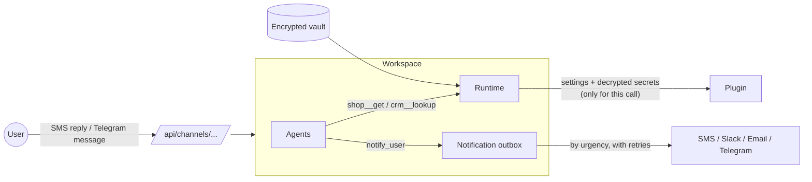

# Integrations and plugins

A **plugin** adds an integration to the platform. A user installs one into a workspace as a
**connection**: a name, settings and secrets. From then on:

- **Tools.** The workspace's agents see the connection's tools, named `{connection}__{tool}`
  (e.g. `shop__get`, `crm__lookup_customer`).
- **Notifications.** Agents' `notify_user` messages are forwarded through the connection (SMS,
  Slack, email, Telegram) at the urgency level the user chose.
- **Inbound.** Messages the user sends back (an SMS reply, a Telegram message) become commands to
  the workspace, from allowed senders only.



## Built-in plugins

| Plugin | Tools | Notifications | Inbound | Notes |
|---|---|---|---|---|
| **MCP server** (`mcp`) | the server's tools | | | Any MCP server over Streamable HTTP (or SSE). Launched-as-a-command (stdio) servers run in an isolated Docker container and must be enabled with `Integrations:AllowStdioMcp`. |
| **HTTP API** (`http-api`) | `get`, and `send` if writes are allowed | | | Any REST API behind one base URL and auth header, e.g. **Shopify Admin** (`X-Shopify-Access-Token`) or Stripe. |
| **Slack** (`slack`) | `post_message` | ✓ | | Incoming webhook. |
| **SMS (Twilio)** (`twilio-sms`) | `send_sms` | ✓ | ✓ | Verifies `X-Twilio-Signature` when `PUBLIC_BASE_URL` is set. |
| **Email (SMTP)** (`email-smtp`) | `send_email` | ✓ | | STARTTLS on 587. A stable Message-ID per notification lets receivers spot retried duplicates. |
| **Telegram** (`telegram`) | `send_message` | ✓ | ✓ | Registers its webhook with a per-connection secret token when `PUBLIC_BASE_URL` is set. |

Nothing in the platform is tied to a particular business domain. Connections, tools, watches,
schedules and webhooks are general building blocks, and what a workspace does comes from your
instructions plus the services you connect. Two examples:

### Example: support triage (webhook, no polling)

1. Create a workspace: "For every new support ticket, classify its urgency, draft a reply, and
   alert me immediately about urgent ones."
2. The coordinator creates a webhook and posts its secret URL in the chat. Point your helpdesk's
   "new ticket" webhook at it.
3. Connect **Slack** (notifications: everything) and **SMS** (notifications: urgent only).
4. Each ticket wakes a standing triage agent with the ticket as untrusted data. It classifies the
   ticket and posts to Slack; urgent tickets also reach your phone.

### Example: a store inventory monitor

1. Create a workspace: "Check my Shopify inventory every hour and alert me when anything drops
   below 10 units."
2. **Integrations → Add connection → HTTP API**:
   - name `shop`
   - base URL `https://{store}.myshopify.com/admin/api/2025-07`
   - auth header `X-Shopify-Access-Token` with a custom app's Admin API token
   - writes left off
3. **Add connection → SMS (Twilio)** with the notification level set to "urgent only".
4. The coordinator sets up a standing monitor with an hourly schedule. The monitor reads stock
   with `shop__get` and calls `notify_user` with `urgency: "urgent"` when something is low, and
   that alert reaches your phone.
5. Reply to the SMS ("also watch the mugs"). If your number is an allowed sender, the reply
   reaches the coordinator as a new instruction.

Alternatively, connect a Shopify MCP server with the `mcp` plugin.

## Security model

- **Secrets never leave the vault, except to plugin code.**
  - Secret fields are encrypted with AES-256-GCM (`Secrets:MasterKey`, or a generated key file on
    a persistent volume), bound to their workspace, connection and field, and stored in the
    `Secrets` table.
  - Grain state, snapshots, the API and agents only ever see *which* secrets are set.
  - Plugin code receives decrypted values for the duration of one call.
  - The agents' `database_query` sandbox role has no access to the table.
- **Agents can't redirect credentials.** Connection endpoints and hosts are fixed by the user when
  connecting. For example, `http-api` only accepts relative paths under its base URL, and rejects
  full URLs, `../` and encoded separators.
- **Inbound commands** need the connection's secret URL, the provider's signature where one exists
  (Twilio, Telegram), and a sender on the connection's **allowed senders** list. Anything else is
  answered normally and ignored, so a stranger who learns the number can't command the agents.
- **Plugins are trusted code.** They run in the server process, as any library does. Install
  third-party plugins only from sources you trust.

## Reliability and token efficiency

- **Crash safety carries over.** Every connection tool keeps its plugin-declared side-effect class
  (from MCP annotations: `readOnlyHint` becomes ReadOnly, `idempotentHint` becomes Idempotent, and
  anything else is NonIdempotent), so a call interrupted by a crash is resumed or reported as
  "outcome unknown" exactly as with built-in tools (see [durability.md](durability.md)). Tools
  receive the call's idempotency key; `http-api` sends it as `Idempotency-Key`.
- **Notifications go through a durable outbox** in the workspace. They're saved in the same write
  as the chat message, delivered with exponential backoff, dropped (with a note in the chat) after
  permanent errors or `NotificationMaxAttempts`, and retried by a reminder after a crash.
- **Tool costs are controlled.**
  - Every enabled tool's definition is sent with every agent LLM call, so each connection enables
    at most `MaxEnabledToolsPerConnection` tools by default; users switch tools on and off per
    connection.
  - Descriptions are capped at `MaxToolDescriptionChars`, and results are truncated to
    `MaxToolResultChars` before they enter an agent's context.
- **Alerts route through `notify_user`.** Agents are told to alert the user this way, which routes
  by urgency to the user's channels, instead of calling SMS tools directly. Messaging tools are
  for contacting other people.

## Writing a plugin

Reference **`AgentRuntime.Plugins.Sdk`** (the `AktorAgents.Plugins.Sdk` package) and implement
`IAgentPlugin` plus any of:

| Interface | Purpose |
|---|---|
| `IToolProviderPlugin` | `ListToolsAsync` (cached by the runtime) and `ExecuteToolAsync` |
| `INotificationChannelPlugin` | `SendNotificationAsync`: return `DeliveryResult.Failed(error, retryable)` to have the runtime retry |
| `IInboundChannelPlugin` | `ParseInboundAsync`: verify the provider's signature, return the sender and text |

Declare settings in the manifest (`Secret = true` for anything sensitive), give every tool an
honest `SideEffects`, and pass `request.IdempotencyKey` to APIs that support idempotency.
Constructor parameters are resolved from dependency injection (`IHttpClientFactory`, logging and
so on).

[`samples/ExamplePlugin`](../samples/ExamplePlugin/WeatherPlugin.cs) is a complete, minimal
plugin. To install a plugin:

```bash
dotnet build samples/ExamplePlugin -c Release
cp samples/ExamplePlugin/bin/Release/net10.0/ExamplePlugin.dll plugins/
docker compose up -d --build   # ./plugins is mounted at /app/plugins
```

It then appears under **Add connection**. Only ship your plugin's own DLL (and dependencies the
host doesn't already have); the SDK and `Microsoft.Extensions.*` come from the host.

## Configuration

| Setting | Env (compose) | Default | |
|---|---|---|---|
| `Secrets:MasterKey` | `SECRETS_MASTER_KEY` | (generated) | Base64 256-bit key. Back it up: secrets can't be decrypted without it. |
| `Secrets:KeyFile` | | `/app/keys/secrets-master.key` | Where a generated key is kept (the `api-keys` volume). |
| `Integrations:PublicBaseUrl` | `PUBLIC_BASE_URL` | | Needed for inbound channels and Twilio signature checks. |
| `Integrations:AllowStdioMcp` | `ALLOW_STDIO_MCP` | `false` | Allow MCP servers launched as commands (in Docker). |
| `Integrations:MaxEnabledToolsPerConnection` | | `20` | |
| `Plugins:Directory` | | `/app/plugins` | Third-party plugin DLLs. |

## API

| Method | Path | |
|---|---|---|
| `GET` | `/api/plugins` | Installed plugins and their setting fields |
| `GET` / `POST` | `/api/workspaces/{id}/connections` | `{plugin_id, name, settings, secrets, notify_level?, allowed_senders?}` |
| `PATCH` | `/api/workspaces/{id}/connections/{cid}` | `{notify_level?, enabled_tools?, allowed_senders?}` |
| `POST` | `/api/workspaces/{id}/connections/{cid}/refresh` | Re-list tools, keeping on/off choices |
| `DELETE` | `/api/workspaces/{id}/connections/{cid}` | Removes it and deletes its secrets |
| `POST` | `/api/channels/{workspaceId}/{connectionId}/{secret}` | Public inbound endpoint (set it as the provider's webhook) |

## Tests

- `IntegrationPluginTests`:
  - the vault round-trips, and rejects values moved to another connection or field, or tampered with;
  - `http-api` path escapes are refused, credentials are attached, writes stay off unless enabled
    and carry an idempotency key;
  - Twilio signature checks;
  - Telegram's secret token and bot filtering;
  - MCP annotation mapping.
- `IntegrationTests`, end to end with a test plugin:
  - tools run with vault secrets that never reach any LLM request, snapshot or state;
  - disabled tools are neither offered nor callable;
  - notifications follow levels, retry, and deliver once;
  - inbound commands are accepted from allowed senders once, and ignored from anyone else;
  - bad credentials leave no secrets behind;
  - removal deletes secrets.
- `McpLiveTests` checks the MCP plugin against a real MCP server when `MCP_TEST_URL` is set.
- `PluginLoaderTests` loads the sample plugin DLL the way the server does.
