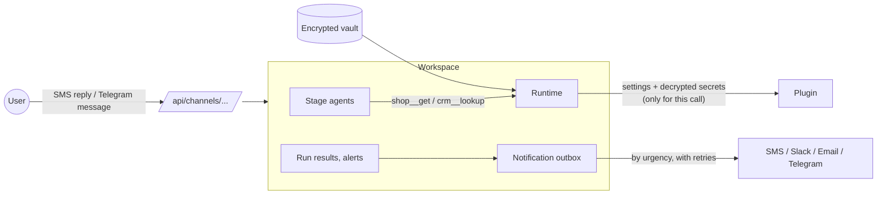
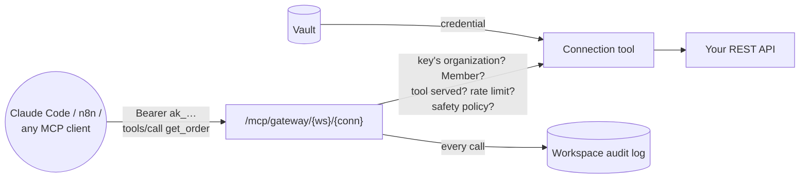

# Integrations and plugins

A **plugin** adds an integration to the platform. A user installs one into a workspace as a
**connection**: a name, settings and secrets. From then on:

- **Tools.** The workspace's agents see the connection's tools, named `{connection}__{tool}`
  (e.g. `shop__get`, `crm__lookup_customer`).
- **Notifications.** Run results, watch alerts, approvals and budget notices are forwarded
  through the connection (SMS, Slack, email, Telegram) at the urgency level the user chose.
- **Inbound.** Messages the user sends back (an SMS reply, a Telegram message) start a run of the
  workspace's pipeline, or decide an approval ("approve A1"), from allowed senders only.


```mermaid
flowchart LR
    subgraph Workspace
      A[Stage agents] -- "shop__get / crm__lookup" --> R[Runtime]
      Run[Run results, alerts] --> O[Notification outbox]
    end
    R -- "settings + decrypted secrets<br/>(only for this call)" --> P[Plugin]
    V[(Encrypted vault)] --> R
    O -- "by urgency, with retries" --> C[SMS / Slack / Email / Telegram]
    U((User)) -- "SMS reply / Telegram message" --> I[/api/channels/.../] --> Workspace
```

## Built-in plugins

| Plugin | Tools | Notifications | Inbound | Notes |
|---|---|---|---|---|
| **MCP server** (`mcp`) | the server's tools | | | Any MCP server over Streamable HTTP (or SSE). Launched-as-a-command (stdio) servers run in an isolated Docker container and must be enabled with `Integrations:AllowStdioMcp`. |
| **HTTP API** (`http-api`) | `get`, and `send` if writes are allowed; plus one tool per [endpoint](#endpoints-for-an-http-api) you add | | | Any REST API behind one base URL and auth header, e.g. **Shopify Admin** (`X-Shopify-Access-Token`) or Stripe. |
| **Slack** (`slack`) | `post_message` | ✓ | | Incoming webhook. |
| **SMS (Twilio)** (`twilio-sms`) | `send_sms` | ✓ | ✓ | Verifies `X-Twilio-Signature` when `PUBLIC_BASE_URL` is set. |
| **Email (SMTP)** (`email-smtp`) | `send_email` | ✓ | | STARTTLS on 587. A stable Message-ID per notification lets receivers spot retried duplicates. |
| **Telegram** (`telegram`) | `send_message` | ✓ | ✓ | Registers its webhook with a per-connection secret token when `PUBLIC_BASE_URL` is set. |

Nothing in the platform is tied to a particular business domain. Connections, tools, watches,
schedules and webhooks are general building blocks, and what a workspace does comes from your
instructions plus the services you connect. Two examples:

### Example: support triage (webhook, no polling)

1. Create a workspace: "For each support ticket: classify its urgency, find the relevant help-centre
   answer, and draft a reply." A pipeline is drafted (e.g. Classify → Research → Draft).
2. **Triggers → Webhook**: its secret URL is shown once. Point your helpdesk's "new ticket" webhook
   at it.
3. Connect **Slack** (notifications: everything) and **SMS** (notifications: urgent only), and set
   the pipeline's result urgency (Run settings).
4. Each ticket starts a run with the ticket as untrusted input; the result goes to Slack, and to
   your phone when urgent.

### Example: a store inventory monitor

1. Create a workspace: "Work out reorder quantities for low-stock products, with a draft purchase
   order."
2. **Integrations → Add connection → HTTP API**:
   - name `shop`
   - base URL `https://{store}.myshopify.com/admin/api/2025-07`
   - auth header `X-Shopify-Access-Token` with a custom app's Admin API token
   - writes left off
3. **Add connection → SMS (Twilio)** with the notification level set to "urgent only".
4. **Triggers → Watch**: call `shop__get` every hour, alert when `inventory_quantity < 10`
   (urgent). The check runs in code, with no model call; the alert reaches your phone. Set the
   watch to **Run the pipeline** instead, and each newly low product starts a run that drafts the
   reorder.
5. Reply to the SMS ("draft a reorder for the mugs"). If your number is an allowed sender, the
   reply starts a run with it as the input.

Alternatively, connect a Shopify MCP server with the `mcp` plugin.

## Endpoints for an HTTP API

Without endpoints, an HTTP API connection gives agents two general tools: `get` (any path under the
base URL) and `send` (any write, if writes are allowed). The agent has to work out paths and
parameters itself. Add the API's operations as **endpoints** and each becomes a tool of its own with
named, typed parameters: `store__get_order {order_id}` instead of
`store__get {path: "/orders/…"}`.

On the connection (when adding it, or later with **edit endpoints**):
- **Add endpoint** by hand: method, path with `{placeholders}` (`/orders/{order_id}`), a tool name,
  what it does (shown to agents), query parameters (string, integer, number or boolean; optionally
  required) and, for writes, an optional JSON schema of the body. Every placeholder is a required
  path parameter.
- **Import from OpenAPI…**: choose or paste an OpenAPI 3 or Swagger 2 document (JSON or YAML), then
  pick the operations to add. Names come from `operationId` (`getOrderById` → `get_order_by_id`),
  `$ref`s inside the document are inlined, and the document's server URL fills an empty base URL.
  The server only reads the document; it never fetches anything it points to. Header and cookie
  parameters are skipped (the connection sets its own headers), and so are operations past the
  first 300.

What the runtime enforces:
- Endpoints are checked when the connection is saved: valid names (lowercase, digits and
  underscores; `get` and `send` are taken), known methods, paths under the base URL (no `..` or
  full URLs), parameters only in the path or query. An invalid list is refused and the old one
  stays.
- A path value must be one segment: values containing `/`, `\` or `..` are refused, and the rest is
  escaped, so an agent can't steer a request to another path.
- `GET` endpoints are read-only tools; `PUT` and `DELETE` idempotent; `POST` and `PATCH` writes
  (with an `Idempotency-Key`). Write endpoints exist only while **Allow writes** is on.
- At most 100 endpoints per connection, and as with any connection only the first
  `MaxEnabledToolsPerConnection` (20) tools start enabled: each enabled tool costs tokens on every
  agent call.

A JSON response comes back to the agent as JSON (`{status, body}`), not as an escaped string.

Endpoints are kept in the connection's `endpoints` setting (a JSON array), so clones and templates
carry them. Over the API: `PATCH …/connections/{cid}` with `{"settings": {"endpoints": "[…]"}}`,
and `POST /api/integrations/openapi` with `{spec}` to turn a document into endpoints.

## MCP gateway: a connection as an MCP server

Any workspace connection with tools can also be **served as an MCP server**, so agents outside
Aktor (Claude Code, n8n, a CrewAI crew, your own MCP client) call its tools directly, with no Aktor
agent team in between. Add your REST API with its endpoints, switch the gateway on, and you have an
MCP server for your API that keeps the credential on the server.


```mermaid
flowchart LR
    C((Claude Code / n8n /<br/>any MCP client)) -- "Bearer ak_…<br/>tools/call get_order" --> G["/mcp/gateway/{ws}/{conn}"]
    G -- "key's organization? Member?<br/>tool served? rate limit?<br/>safety policy?" --> X[Connection tool]
    V[(Vault)] -- credential --> X
    X --> API[Your REST API]
    G -- every call --> A[(Workspace audit log)]
```

On the connection's card, **Serve as an MCP server**:
- Pick the tools callers get. This is separate from the tools the workspace's agents have enabled.
  Switching it on serves the read tools to start with; add writes deliberately.
- Copy the URL, `{API}/mcp/gateway/{workspace id}/{connection id}`, or the Claude Code command:

  ```bash
  claude mcp add --transport http store https://your-aktor/mcp/gateway/ws-…/conn-… \
    --header "Authorization: Bearer ak_…"
  ```

What the runtime enforces on every call:
- **Who:** an API key (or a session) of the workspace's organization. Viewer keys can list the
  tools; calling them needs Member. Another organization's key gets a 404.
- **What:** only the served tools, only while the gateway is on and the workspace is active.
- **Safety policy:** the organization's and the workspace's rules apply to the tool's exposed name
  (`store__create_refund`), exactly as for agents. A call they block is refused, and so is one that
  needs approval: nobody is there to approve it while the caller waits.
- **Credential:** used inside the server for the call; it never appears in a result or the audit log.
- **Rate limit:** `Integrations:GatewayCallsPerMinute` (60) per connection, all callers together
  (per server process).
- **Audit:** every call, refused ones included, is in the workspace's audit log as `gateway.call`
  with the key, the arguments, the outcome and a truncated result.

The gateway speaks MCP over streamable HTTP, statelessly (one JSON response per request, no
sessions or server-sent stream), with `initialize`, `tools/list`, `tools/call` and `ping`. Tool
annotations follow the side effects: `readOnlyHint` for reads, `destructiveHint` for writes. A clone
or template of the workspace starts with the gateway off.

This works for any plugin with tools: an MCP server connected to a workspace can be re-served the
same way, behind the workspace's key, policy and audit log.

## Security model

- **Secrets never leave the vault, except to plugin code.**
  - Secret fields are encrypted with AES-256-GCM (`Secrets:MasterKey`, or a generated key file on
    a persistent volume), bound to their workspace, connection and field, and stored in the
    `Secrets` table.
  - Grain state, snapshots, the API and agents only ever see *which* secrets are set.
  - Plugin code receives decrypted values for the duration of one call.
  - The agents' `database_query` sandbox role has no access to the table.
- **Agents can't redirect credentials.** Connection endpoints and hosts are fixed by the user when
  connecting. For example, `http-api` only accepts relative paths under its base URL, and rejects
  full URLs, `../` and encoded separators.
- **Inbound commands** need the connection's secret URL, the provider's signature where one exists
  (Twilio, Telegram), and a sender on the connection's **allowed senders** list. Anything else is
  answered normally and ignored, so a stranger who learns the number can't command the agents.
- **Plugins are trusted code.** They run in the server process, as any library does. Install
  third-party plugins only from sources you trust.

## Reliability and token efficiency

- **Crash safety carries over.** Every connection tool keeps its plugin-declared side-effect class
  (from MCP annotations: `readOnlyHint` becomes ReadOnly, `idempotentHint` becomes Idempotent, and
  anything else is NonIdempotent), so a call interrupted by a crash is resumed or reported as
  "outcome unknown" exactly as with built-in tools (see [durability.md](durability.md)). Tools
  receive the call's idempotency key; `http-api` sends it as `Idempotency-Key`.
- **Notifications go through a durable outbox** in the workspace. They're saved in the same write
  as the chat message, delivered with exponential backoff, dropped (with a note in the chat) after
  permanent errors or `NotificationMaxAttempts`, and retried by a reminder after a crash.
- **Tool costs are controlled.**
  - Every enabled tool's definition is sent with every agent LLM call, so each connection enables
    at most `MaxEnabledToolsPerConnection` tools by default; users switch tools on and off per
    connection.
  - Descriptions are capped at `MaxToolDescriptionChars`, and results are truncated to
    `MaxToolResultChars` before they enter an agent's context.
- **Alerts route through the workspace.** Run results and watch alerts reach the user's channels
  by urgency; agents don't call SMS tools to reach the user. Messaging tools are for contacting
  other people.

## Writing a plugin

Reference **`AgentRuntime.Plugins.Sdk`** (the `AktorAgents.Plugins.Sdk` package) and implement
`IAgentPlugin` plus any of:

| Interface | Purpose |
|---|---|
| `IToolProviderPlugin` | `ListToolsAsync` (cached by the runtime) and `ExecuteToolAsync` |
| `INotificationChannelPlugin` | `SendNotificationAsync`: return `DeliveryResult.Failed(error, retryable)` to have the runtime retry |
| `IInboundChannelPlugin` | `ParseInboundAsync`: verify the provider's signature, return the sender and text |

Declare settings in the manifest (`Secret = true` for anything sensitive), give every tool an
honest `SideEffects`, and pass `request.IdempotencyKey` to APIs that support idempotency.

`ExecuteToolAsync` gets a `ToolExecutionRequest` stamped by the runtime, never by the agent:

| Field | |
|---|---|
| `ToolName`, `ArgumentsJson` | The call (arguments come from the model: validate them) |
| `AgentId`, `TaskId` | The calling agent and its task (a workspace run's id is `run-…`) |
| `TenantId` | The agent's organization: scope anything you keep by it |
| `WorkspaceId` | The agent's workspace, or null for a task agent: scope per-workspace data by it, not by `TaskId` |
| `IdempotencyKey` | Stable across retries of the same call |
| `GrantedPermissions` | What the runtime granted the agent |
Constructor parameters are resolved from dependency injection (`IHttpClientFactory`, logging and
so on).

[`samples/ExamplePlugin`](../samples/ExamplePlugin/WeatherPlugin.cs) is a complete, minimal
plugin. To install a plugin:

```bash
dotnet build samples/ExamplePlugin -c Release
cp samples/ExamplePlugin/bin/Release/net10.0/ExamplePlugin.dll plugins/
docker compose up -d --build   # ./plugins is mounted at /app/plugins
```

It then appears under **Add connection**. Only ship your plugin's own DLL (and dependencies the
host doesn't already have); the SDK and `Microsoft.Extensions.*` come from the host.

## Configuration

| Setting | Env (compose) | Default | |
|---|---|---|---|
| `Secrets:MasterKey` | `SECRETS_MASTER_KEY` | (generated) | Base64 256-bit key. Back it up: secrets can't be decrypted without it. |
| `Secrets:KeyFile` | | `/app/keys/secrets-master.key` | Where a generated key is kept (the `api-keys` volume). |
| `Integrations:PublicBaseUrl` | `PUBLIC_BASE_URL` | | Needed for inbound channels and Twilio signature checks. |
| `Integrations:AllowStdioMcp` | `ALLOW_STDIO_MCP` | `false` | Allow MCP servers launched as commands (in Docker). |
| `Integrations:MaxEnabledToolsPerConnection` | | `20` | |
| `Integrations:GatewayCallsPerMinute` | | `60` | Calls per minute to one connection's MCP gateway. |
| `Plugins:Directory` | | `/app/plugins` | Third-party plugin DLLs. |

## API

| Method | Path | |
|---|---|---|
| `GET` | `/api/plugins` | Installed plugins and their setting fields |
| `GET` / `POST` | `/api/workspaces/{id}/connections` | `{plugin_id, name, settings, secrets, notify_level?, allowed_senders?}` |
| `PATCH` | `/api/workspaces/{id}/connections/{cid}` | `{notify_level?, enabled_tools?, allowed_senders?, settings?, gateway?}`: `settings` changes non-secret settings such as `endpoints` (checked again; refused if invalid); `gateway` is `{enabled, tools}` |
| `POST` | `/api/integrations/openapi` | `{spec}` (JSON or YAML): `{title, base_url, endpoints, warnings}`; saves nothing. Member |
| `POST` | `/mcp/gateway/{id}/{cid}` | The connection's MCP gateway (JSON-RPC; `Authorization: Bearer ak_…`) |
| `POST` | `/api/workspaces/{id}/connections/{cid}/refresh` | Re-list tools, keeping on/off choices |
| `DELETE` | `/api/workspaces/{id}/connections/{cid}` | Removes it and deletes its secrets |
| `POST` | `/api/channels/{workspaceId}/{connectionId}/{secret}` | Public inbound endpoint (set it as the provider's webhook) |
| `GET` / `POST` | `/api/tasks/{id}/connections` | A task's own tool connections (MCP, HTTP API): `{plugin_id, name, settings, secrets}`; Member |
| `PATCH` / `DELETE` | `/api/tasks/{id}/connections/{cid}` | `{enabled_tools?, settings?}`, or remove it and its secrets |
| `POST` | `/api/tasks/{id}/connections/{cid}/refresh` | Re-list its tools |

**Tasks** can have connections too, for tools only (MCP servers, HTTP APIs; no inbound channels or
notifications). The root agent and every agent it starts see the enabled tools from their next step.
Secrets are stored in the vault under the task. See [tasks.md](tasks.md#connecting-mcp-servers).

## Tests

- `IntegrationPluginTests`:
  - the vault round-trips, and rejects values moved to another connection or field, or tampered with;
  - `http-api` path escapes are refused, credentials are attached, writes stay off unless enabled
    and carry an idempotency key;
  - Twilio signature checks;
  - Telegram's secret token and bot filtering;
  - MCP annotation mapping.
- `IntegrationTests`, end to end with a test plugin:
  - tools run with vault secrets that never reach any LLM request, snapshot or state;
  - disabled tools are neither offered nor callable;
  - notifications follow levels, retry, and deliver once;
  - inbound commands are accepted from allowed senders once, and ignored from anyone else;
  - bad credentials leave no secrets behind;
  - removal deletes secrets.
- `HttpApiEndpointTests`: endpoints are validated, become typed tools (writes only when allowed),
  build requests under the base URL, refuse path values that leave their segment, and OpenAPI 3
  YAML and Swagger 2 JSON import with `$ref`s inlined.
- `ConnectionGatewayTests`, end to end with a real MCP client and a local REST API: hand-written
  endpoints are listed and called through the gateway with the stored credential, which never
  comes back; a supervised workspace refuses writes; every call is audited; nothing is served
  before it's switched on, after it's switched off, or to another organization; endpoints imported
  from OpenAPI can be saved later, and invalid ones are refused.
- `McpLiveTests` checks the MCP plugin against a real MCP server when `MCP_TEST_URL` is set.
- `PluginLoaderTests` loads the sample plugin DLL the way the server does.
