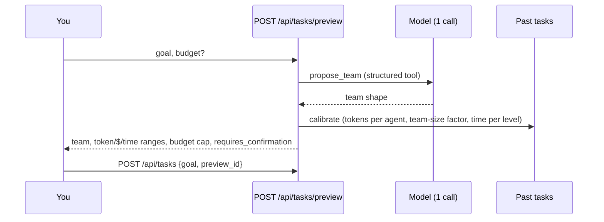

# Cost and team preview

An agent team decides its own shape, so before a run the question is always "how big will this
get, and what will it cost?" Every new task in the dashboard starts with a **preview** that answers
it. The runtime still enforces the actual budget whatever the estimate says.

## What a preview returns

- **Team shape:** the roles the root agent would likely start, by depth, from one planning call
  with a single structured tool (`propose_team`). The model is told the runtime's limits, so it
  doesn't plan a team that can't exist.
- **Estimates as ranges:**
  - tokens, dollars and duration, each as low / expected / high (0.5× and 2× the expected value by
    default);
  - expected tokens = planned team size × team-size factor × tokens per agent, priced at the
    configured model prices.
- **The budget:** what the task will actually be capped at, after the server's task ceiling. If the
  high end is cut by the budget, `capped_by_budget` says so. The team is then stopped (and reports
  what it has) before it can spend more.
- **Confirmation:** `requires_confirmation` is true when the high cost is above
  `Preview:ConfirmAboveUsd` ($2.00 by default). The dashboard then asks before starting; below the
  threshold it starts right away and shows the preview next to the run.
- **The preview's own cost**, which is metered against the organization like any LLM call. Over
  quota, previews are refused too.

If the planning call fails, the preview falls back to a root-only plan rather than blocking the
task.

## Calibration: estimate vs actual

Start the task with the preview's `preview_id` and the estimate is kept with it. When the task
finishes, its result's metrics include the comparison:

| Metric | |
|---|---|
| `estimated_cost_usd`, `estimated_cost_usd_range`, `estimated_tokens`, `estimated_team_size` | What the preview said |
| `actual_team_size`, `total_cost_usd`, `total_tokens_used` | What happened |
| `cost_estimate_ratio`, `token_estimate_ratio` | Actual ÷ expected |

The next previews calibrate on the organization's last `Preview:CalibrationTasks` (20) finished
tasks:
- **Tokens per agent:** the median of each task's tokens ÷ agents.
- **Team-size factor:** the median of agents actually used ÷ agents planned, from tasks that had a
  preview.
- **Time per tree level:** the median of each task's duration ÷ its depth.

Replays are left out. With no history yet, the defaults apply (`DefaultTokensPerAgent` 40,000 and
`DefaultSecondsPerLevel` 90), and the preview says so.

## Spend during the run

`GET /api/tasks/{id}/spend` returns, for every agent, its own spend and its **branch's** (it plus
everything below it), next to its budget. Every child's budget is carved from its parent's
remaining budget, so a branch's spend stays inside the budget of the agent at its top. The graph
shows this as a bar on each agent (amber past 75%, red past 90%).

## API

| Method | Path | |
|---|---|---|
| `POST` | `/api/tasks/preview` | `{goal, budget?}` → the preview above |
| `POST` | `/api/tasks` | `{goal, budget?, preview_id?}` |
| `GET` | `/api/tasks/{id}/spend` | Per agent and branch: tokens, cost, budget |
| `GET` | `/api/tasks/{id}/result` | `result.metrics` includes estimate vs actual |

## Tests

- `CostEstimatorTests` (unit): ranges, the budget cap, calibration from history, and parsing the
  planning call (including bad or missing answers).
- `PreviewApiTests` (against Postgres): a preview of the demo goal plans the mock's real team; a
  task started from it reports estimate vs actual; the next preview is calibrated on it; and the
  spend endpoint's branches add up.
