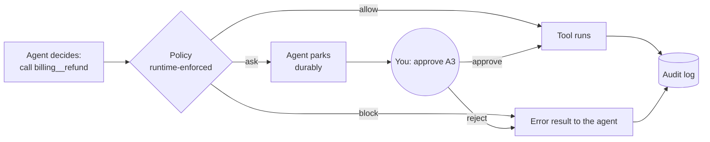

# Safety and trust

Agents that run for months, with access to real services, need controls that don't depend on the
model behaving well. Each workspace has a **safety policy**, which the runtime enforces around
every tool call. The runtime also keeps an **audit log**, which can prove afterwards what happened.

## The policy

**Autonomy level.** This is the default for calls that no rule covers:

| Level | External reads | External writes that are safe to repeat | Writes that aren't (send, pay, delete) |
|---|---|---|---|
| `Autonomous` (default) | run | run | run |
| `SemiAutonomous` | run | run | **ask** |
| `Supervised` | run | **ask** | **ask** |

- **"External" means effects outside the platform.** That covers connection tools
  (`{connection}__{tool}`), `shell_exec`, `http_request` and `database_query`.
- **Internal work never waits for a human.** This includes agents spawning and messaging each
  other, memory, schedules, workspace files and `notify_user`.
- **Reads never wait for a human either.** Whether a call is a read, a repeatable write or an
  unrepeatable write comes from the side-effect class that each tool, or its plugin, declares (see
  [plugins.md](plugins.md)).

**Rules** are checked first, in order, and the first match wins. Each rule has:
- a tool-name pattern, where `*` matches anything: `billing__*`, `*__send_sms`, `shell_exec`;
- a scope: `any` call, `writes`, or `unsafe` writes only;
- a decision: `allow`, `block` or `ask`.

For example, with the level set to `Autonomous` plus the rule `billing__* writes → ask`, everything
runs on its own except changes to billing.

Only you can change the policy, through the UI or the API. Agents have no tool for it, and messages
from agents or channels can't change it either.

## Approvals

When a call needs approval:

1. The runtime records a request with a short code (`A3`). The request holds the tool, its full
   arguments, the agent's stated reason (its visible message, never hidden reasoning) and the rule
   that triggered it.
2. The request is posted to the chat as a warning, so it also reaches your notification channels.
3. **The agent parks.** The call has no result yet, so the turn stays open. The agent's state is
   saved and it uses no LLM calls while it waits.
4. You decide in one of three ways:
   - **Safety tab or chat banner:** Approve or Reject, with an optional reason.
   - **Chat, SMS or Telegram:** reply `approve A3`, `yes A3`, `reject A3 too expensive` or `no A3`.
     Channel replies count only from the connection's **allowed senders**, and decisions aren't
     forwarded to the agents as instructions.
   - **API:** `POST /api/workspaces/{id}/approvals/{approvalId}/decision`.
5. The agent wakes up.
   - If you approved, the call runs exactly once, with the same idempotency key.
   - If you rejected, the agent gets an error result with your reason and is told not to retry
     unless you ask.

**Durability** follows from how approvals are stored:
- Requests live in the workspace's state, keyed by the call's id.
- A parked agent survives crashes and restarts: its recovery reminder re-checks the call, which is
  still pending, and parks it again. Re-checking never creates a second request.
- **Stopping** a parked agent still works; it's the one input a parked agent accepts. Approving
  afterwards runs nothing.
- **Expiry.** A request nobody answers expires after `approval_timeout_hours` (72 by default), and
  the agent is told the action didn't run.
- A call that already has a decision keeps it, even if the policy changes later.

## The audit log

Every action that matters is appended to the workspace's audit log:
- **Every agent tool call**, with its outcome (`ok`, `failed`, or `unknown` for a call cut off by a
  crash), arguments, a truncated result and the agent's stated reason. Simulation moves and
  `wait_for_events` / `end_turn` aren't recorded.
- **Blocked calls**, and approvals requested, approved, rejected and expired.
- **Your commands**, from the chat or channels.
- **Configuration changes:** policy updates, connections added, changed or removed, triggers added
  and removed, and pause, resume and archive.
- **Watch alerts.**

**Tamper evidence.**
- Records are chained per workspace: each one's SHA-256 hash covers its content and the previous
  record's hash.
- Changing, inserting or deleting a record breaks the chain from that point. Deleting the newest
  records is also caught, because a head row keeps the chain's last sequence number and hash.
- **Verify integrity** in the Safety tab (`GET /audit/verify`) recomputes the whole chain.

**Exactly once.** Each record has a key, such as `{agent}:{call}:exec`. A step replayed after a
crash is therefore recorded once, never twice or zero times.

**Storage.** The records live in Postgres (`AuditEntries`, `AuditHeads`). Appends lock the head
row, so concurrent writers are sequenced without gaps. The agents' `database_query` sandbox role
can't read these tables or write to them.

This is **tamper-evident, not tamper-proof.**
- Someone with write access to the database could rewrite the entire chain.
- For stronger guarantees, export the latest head hash to somewhere they can't reach (a
  write-once bucket, a ticket, an email), then compare it later.

## API

| Method | Path | |
|---|---|---|
| `GET` / `PUT` | `/api/workspaces/{id}/policy` | `{autonomy, rules: [{name, tool_pattern, applies, decision}], approval_timeout_hours}` |
| `GET` | `/api/workspaces/{id}/approvals?status=Pending` | Newest first |
| `POST` | `/api/workspaces/{id}/approvals/{approvalId or code}/decision` | `{approve, reason?}` |
| `GET` | `/api/workspaces/{id}/audit?actor=&action=tool.&q=&since=&before=&limit=` | Newest first; `before` pages by sequence number |
| `GET` | `/api/workspaces/{id}/audit/verify` | `{valid, records, first_broken_seq, message}` |

## Tests

- **Unit:**
  - `PolicyEngineTests`: autonomy levels, internal tools, rule order and scopes, glob matching.
  - `AuditLogTests`: chaining, idempotent keys, tamper detection including a re-hashed forgery,
    unambiguous field boundaries.
- **Integration (`SafetyTests`):**
  - a write parks until it's approved, then runs once and is fully audited;
  - a rejection from an allowed sender reaches the agent as an error, while a stranger's approval
    is ignored;
  - `approve a1` typed in the chat decides without reaching the agent;
  - deny rules block without asking, and reads run even when `Supervised`;
  - a parked agent can be stopped, and approving afterwards runs nothing;
  - a pending approval survives a crash, and approving afterwards runs the call once.
