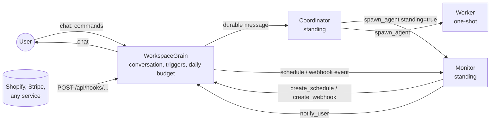

# Workspaces

A workspace is a long-running environment where a user's agents live. The user describes what
they want once, or keeps giving instructions over time. The agents set themselves up (standing
monitors, schedules, webhooks) and keep working for as long as the workspace exists, surviving
restarts and crashes (see [durability.md](durability.md)).

## Pieces

| Piece | What it is |
|---|---|
| **Coordinator** | A standing agent created with the workspace. It receives every user message and decides whether to do the work itself, hand it to an existing agent (`find_agents`, `send_message`), or spawn a new one. It never completes. |
| **Standing agent** | Spawned with `spawn_agent standing=true`. It handles each wake-up (message, schedule, webhook, a child finishing), then calls `wait_for_events`. It sees a sliding window of recent history (`Workspaces:StandingContextWindow`) and keeps long-lived facts in `write_memory`. Its budget renews every 24 hours. |
| **Worker** | Spawned with `standing=false`. It does one job, then calls `complete_task`, and its parent is notified automatically. |
| **Schedule** | `create_schedule` with `every_minutes` or a 5-field UTC `cron` expression. Backed by an Orleans reminder, so it survives crashes and restarts. |
| **Webhook** | `create_webhook` creates `POST /api/hooks/{workspace}/{trigger}/{secret}`. The secret URL is shown to the user, never to an agent. |
| **Conversation** | The user's messages, agents' `notify_user` messages (with urgency `info`, `warning` or `urgent`), and system notices. Phase 3 connectors (Slack, SMS, email) will forward these. |
| **Daily budget** | One token and dollar limit for the whole workspace per UTC day, checked by the runtime before every LLM call. When it's used up, agents pause until midnight UTC and the user is told once. |

## Webhooks

- **Authentication:** the secret in the URL, compared in constant time. A wrong secret and an
  unknown trigger both return `404`, so ids can't be probed.
- **Acknowledgement:** `202 Accepted` is returned only after the event is durably in the target
  agent's mailbox.
- **Deduplication:** senders retry, so redeliveries are dropped. The delivery id is taken from
  `Idempotency-Key`, `X-Shopify-Webhook-Id`, `X-GitHub-Delivery`, `Webhook-Id`, `X-Request-Id`
  or `X-Delivery-Id`, or failing that the body within the same minute. A duplicate returns
  `200 {"status":"duplicate"}`.
- **Rate limiting:** deliveries beyond `Workspaces:MaxWebhookEventsPerMinute` per trigger get
  `429` and are counted as dropped. A chatty integration can't turn into an LLM bill.
- **Payload handling:** payloads are truncated to `Workspaces:MaxWebhookPayloadChars` and
  labelled as untrusted external data for the agent. Bodies over `MaxWebhookBodyBytes` get `413`.
- **Paused or archived workspaces** return `409`.
- **Dead targets:** if a trigger's agent is no longer running, the event goes to the coordinator
  with a note, so nothing fires into the void.

## Token efficiency

Everything that runs indefinitely is designed to cost nothing while nothing is happening:
- **No polling loops:** agents only run when woken by an event.
- **Flat cost per wake-up:** standing agents see a bounded window of history, however long they've
  been running.
- **Prompt rules for workspace agents:**
  - prefer webhooks over polling;
  - pick the longest schedule interval that works;
  - reuse existing agents and triggers instead of creating new ones;
  - never send "nothing happened" notifications.
- **Hard caps:** a daily per-agent budget and a daily workspace budget, enforced by the runtime.
- **Resuming is cheap:** resuming a paused workspace unpauses agents without forcing an LLM call
  for each one.

Phase 4 adds compiled watchers: rules the LLM writes once, which the runtime evaluates without an
LLM call. For example, "alert when stock < 10" would cost zero tokens per check.

## API

| Method | Path | |
|---|---|---|
| `POST` | `/api/workspaces` | `{name, goal, daily_token_limit?, daily_cost_limit_usd?}` |
| `GET` | `/api/workspaces` | List |
| `GET` | `/api/workspaces/{id}` | Snapshot: conversation, agents, triggers, budget |
| `POST` | `/api/workspaces/{id}/messages` | `{text, to_agent_id?, client_message_id?}`; retries with the same `client_message_id` deliver once |
| `GET` / `POST` | `/api/workspaces/{id}/triggers` | `{kind: schedule\|webhook, name, instruction, target_agent_id?, every_minutes?, cron?}`; a created webhook's response includes its secret `webhook_path` |
| `DELETE` | `/api/workspaces/{id}/triggers/{triggerId}` | |
| `PUT` | `/api/workspaces/{id}/budget` | `{daily_token_limit?, daily_cost_limit_usd?}` |
| `POST` | `/api/workspaces/{id}/pause` \| `resume` \| `archive` | |
| `POST` | `/api/hooks/{workspaceId}/{triggerId}/{secret}` | Inbound webhook (public) |

The live event stream is `/ws/events?taskId={workspaceId}`.

## Tests

`WorkspaceTests` checks, with a scripted LLM:
- a goal becomes a standing agent whose schedule reports each time it fires;
- a user command sent twice with the same client id is delivered once;
- webhooks: the wrong secret is rejected, a redelivery is deduplicated, a burst is rate-limited,
  and the secret never appears in anything an agent sees;
- the daily budget stops LLM calls and posts one notice;
- pause stops triggers and resume starts them;
- schedules keep firing after the silo is killed.

`CronScheduleTests` covers cron parsing.
