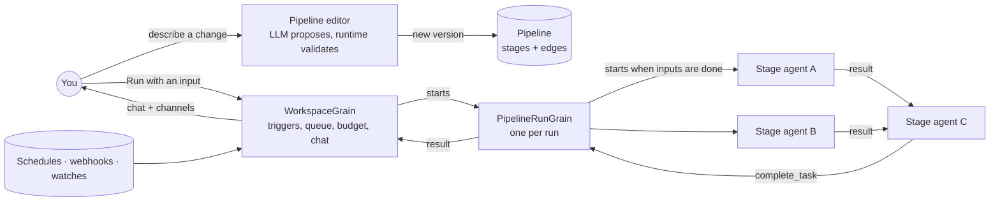

# Workspaces

A workspace is a reusable agent pipeline. You describe the job once ("research a market I name
and write a fact-checked report"), a pipeline of agents is drafted from it, and you run it as
often as you like: by hand with an input, or automatically from a schedule, a webhook or a watch.
Change any stage in plain language ("add a security reviewer after Backend") or on the canvas;
every change is a new version you can undo.

```mermaid
flowchart LR
    You((You)) -- "describe a change" --> Editor[Pipeline editor<br/>LLM proposes, runtime validates]
    Editor -- "new version" --> P[(Pipeline<br/>stages + edges)]
    You -- "Run with an input" --> WS[WorkspaceGrain<br/>triggers, queue, budget, chat]
    Hooks[(Schedules · webhooks · watches)] --> WS
    WS -- "starts" --> Run[PipelineRunGrain<br/>one per run]
    Run -- "starts when inputs are done" --> A[Stage agent A]
    Run --> B[Stage agent B]
    A -- "result" --> C[Stage agent C]
    B -- "result" --> C
    C -- "complete_task" --> Run
    Run -- "result" --> WS
    WS -- "chat + channels" --> You
```

## Pieces

| Piece | What it is |
|---|---|
| **Pipeline** | A graph of stages, versioned. Stages with no inputs start with the run; a stage starts once all its inputs have finished; stages nothing depends on give the run's result. Limits come from `Pipelines:*` (20 stages, 5 helpers per stage, 3 retries, 240 minutes per run). |
| **Stage** | An agent with a name, role, instructions and tools (from capability words such as `research`, `http`, `shell`). Settings: helpers it may start (`max_helpers`), whether it may message the run's other stages, retries, what happens if it fails (`FailRun` or `Continue`), and an optional cost cap. Every stage can read and write the run's files and use the workspace's connections. |
| **Run** | One execution of the pipeline with an input: a task typed by a person, a schedule's instruction, a webhook's payload, or a watch's matches. A run is an actor (`PipelineRunGrain`) and the root of its agent tree, and it is also a task: `/api/tasks/{run_id}` and the dashboard's task view show its agent graph, files, events, spend and result. |
| **Trigger** | A schedule (`every_minutes` or a 5-field UTC `cron`), a webhook, or a watch. Schedules and webhooks start a run; a watch alerts you, or starts a run with only the newly matching items. Schedules are Orleans reminders, so they survive crashes and restarts. |
| **Conversation** | Run notices and results, watch alerts, approvals and system notices. A message typed in the chat starts a run with it as the input; addressed to an agent of a run in progress, it reaches that agent instead. Results go to connected channels (SMS, Slack, email) by the pipeline's result urgency. |
| **Daily budget** | One token and dollar limit for the whole workspace per UTC day, checked by the runtime before every LLM call of every run. At 80% the chat warns once. When it's used up, the chat says so once, a banner with a **Raise budget** button stays in the header, and agents that need to run are paused until midnight UTC or until the budget is raised. |

## How a run works

1. The workspace checks the pipeline's runs-at-once limit (`max_concurrent_runs`). With no free
   slot, or while the workspace is paused, the run waits in a queue (a run and its task row exist
   from the start, so callers can follow it). Queued runs start on the pipeline as it is then.
2. The run starts every stage whose inputs are done. Each stage's agent gets its instructions as
   its goal, plus the run's input, the summaries and files of its inputs, and who gets its result.
   Independent stages run at the same time.
3. A stage finishes with `complete_task`. Its summary and files are handed to the stages that take
   it as input. A stage that fails (or stops without reporting) is retried with a note about what
   went wrong; after its retries, `FailRun` stops the run and skips what's left, while `Continue`
   lets later stages run, told it failed.
4. When every stage has finished, failed or been skipped, the run's result is its output stages'
   summaries. It's recorded on the run and the task, posted in the chat, and forwarded to
   channels. The run times out after `max_run_minutes`.

Pausing a run (or the workspace) pauses its agents and starts no new stages; resuming carries on.
Cancelling stops every agent of the run and skips its unfinished stages.

## Editing a pipeline

- **In plain language:** "Describe a change" sends the request and the current pipeline to one
  model call (`PipelineDesignPrompt`), which proposes edits: `add_stage` (after a stage, before
  one, or with explicit inputs for a parallel branch), `update_stage`, `remove_stage`, `connect`,
  `disconnect`. The runtime applies and validates them (`PipelineEditor`, `PipelineValidator`): no
  loops, inputs that exist, known capabilities, limits. The canvas previews the result (new stages
  green, changed amber, removed struck through) and nothing changes until you apply it.
- **On the canvas:** a + on any connection inserts a stage there, + before an entry stage or after
  an output stage adds one at the ends, × removes a stage (its inputs are joined to what it fed),
  and clicking a stage edits its settings.
- **Versions:** every applied change is a new version; an edit based on an older version is
  refused as a conflict. **History** restores any kept version (as a new version).
- **From a template:** see [templates.md](templates.md) for nine real-world pipelines to start from.
- **A new workspace** is drafted from its description by the same editor. If the model can't
  propose a valid pipeline, the workspace starts with one stage that does its purpose.

## Inside a stage

Stages are autonomous within their limits:
- they use their tools and the workspace's connections, under the workspace's safety policy;
- with `max_helpers` above 0, they can start helpers for big parallel parts, through
  `plan_request`: the model lists the parts, and a fixed rule (`WorkPlanner`) decides whether
  splitting pays off and how many helpers it needs, never more than the stage allows;
- with `may_message_stages`, they can ask a stage working at the same time a quick question
  (`find_agents`, `send_message`).

**Runtime rules (enforced whatever the model says):**

| Rule | Effect |
|---|---|
| `spawn_agent` requires `why_not_myself` | A spawn without a stated reason is rejected. The reason appears in the `AgentSpawnRequested` and `AgentSpawned` events. |
| Helpers come from a plan | A spawn with no plan, or beyond it, is rejected. The plan's helper count is capped by the stage's `max_helpers`. |
| Helpers can't spawn | Helpers get no `spawn_agent` tool and a `MaxChildren` of 0. |
| The spawn result states the cost | For example: "This helper may spend up to 150,000 tokens / $0.75, paid from the workspace's shared daily budget (412,000 tokens / $1.64 left today)." |
| A stage that stops without reporting fails | Nothing else would ever wake it, so waiting would stall the run. |

## Running out of budget

An agent doesn't fail when its own budget runs out. `BudgetGuard` checks before every LLM call:

1. **Warning.** Once 75% (`RuntimeLimits:WrapUpAtFraction`) of any budget is spent (tokens, tool
   calls, cost or time), or only a few calls' worth of tokens remain, the agent is told to finish
   and to report a `partial` result if it can't.
2. **Final step.** When only one more call fits, that call offers nothing but `complete_task`, with
   output capped at `RuntimeLimits:FinalStepMaxOutputTokens`. `complete_task` is exempt from the
   tool-call budget, so an agent out of tool calls can still report.
3. **Runtime report.** If the agent doesn't report in that call, or not even one more call fits,
   the runtime completes it as `partial` with its latest notes and the unfinished goal as
   remaining work.

A partial result is handed on like any other, marked partial, so later stages work with what
there is.

## Webhooks

- **Authentication:** the secret in the URL, compared in constant time. A wrong secret and an
  unknown trigger both return `404`, so ids can't be probed.
- **Acknowledgement:** `202 Accepted` once the run is started or queued.
- **Deduplication:** senders retry, so redeliveries are dropped. The delivery id is taken from
  `Idempotency-Key`, `X-Shopify-Webhook-Id`, `X-GitHub-Delivery`, `Webhook-Id`, `X-Request-Id`
  or `X-Delivery-Id`, or failing that the body within the same minute. A duplicate returns
  `200 {"status":"duplicate"}`. The run id is derived from the delivery, so a retried fire after a
  crash can't start a second run.
- **Rate limiting:** deliveries beyond `Workspaces:MaxWebhookEventsPerMinute` per trigger get
  `429` and are counted as dropped.
- **Payload handling:** payloads are truncated to `Workspaces:MaxWebhookPayloadChars` and
  labelled as untrusted external data in the run's input. Bodies over `MaxWebhookBodyBytes` get `413`.
- **Paused or archived workspaces** return `409`.

## Token efficiency

- **No polling loops:** nothing runs between runs; a schedule or webhook starts one.
- **Watches** check a connected service in code, at zero tokens per check, and only alert or start
  a run for newly matching items (see [efficiency.md](efficiency.md)).
- **Stages work alone by default.** Helpers cost a model call per step each, so a stage starts them
  only through a plan, and only up to its limit.
- **Hard caps:** the workspace's daily budget, each stage's cost cap, and the run's time limit.

## Files

Agents save deliverables with `filesystem_write`. Each run has its own folder, so later stages of
the run can read what earlier ones saved, and runs never overwrite each other. The **Files** tab
lists every run's files under `run-<number>/`; download them one at a time or all as a zip. A file
is marked **in progress** while its author is still running, **unfinished** if it failed, and
**final** otherwise.

## The workspace screen

Every section is resizable: drag a divider (or focus it and use the arrow keys; double-click
resets it). Sizes are remembered per browser.

- **Left:** your workspaces.
- **Center top, Live agents:** the team at work, like the simulation map. You sit at the top, each
  recent run below you, its stage agents below the run, and their helpers below them, joined by
  dashed lines. For about 20 seconds after something happens, messages between agents animate as
  coloured arrows (task, done, question and answer, started), runs started by you and their
  results flow as arrows to and from you, and speech bubbles show what each agent last said or did
  (planning, saving a file, searching). Agents of runs that finished over 30 minutes ago drop off;
  finished agents of recent runs are hidden behind "+N earlier finished agents". **Running only**
  hides every finished run, and each run's chip (#12) hides or shows that run; the choice is
  remembered per workspace in your browser. The tab counts agents working now.
- **Center top, Pipeline:** the pipeline canvas, with "Describe a change", **History** and **Run
  settings** (time limit, runs at once, result urgency). With a run selected, the canvas shows that
  run: each stage's status, a pulsing marker on stages working now, and its result when clicked.
  Both tabs stay loaded, so switching loses neither an unapplied change nor the live history.
- **Center bottom:** **Run** with an input, and the runs, newest first, with pause, resume and
  cancel for runs in progress and a link to each run's full page.
- **Right:** Chat, Agents (of recent runs), Files, Skills & knowledge, Triggers (schedules,
  webhooks, watches), Integrations, Safety and Events. Clicking an agent, on either canvas or in
  the list, opens its details beside the canvas.

## Workspaces made before pipelines

Earlier workspaces ran on a coordinator agent and standing agents. On first use they are converted:
they get a one-stage pipeline that does their purpose, their schedules and webhooks start runs of
it, and the old agents are retired. Their chat, files, connections, safety policy and budget stay.

## API

| Method | Path | |
|---|---|---|
| `POST` | `/api/workspaces` | `{name, goal, daily_token_limit?, daily_cost_limit_usd?, pipeline?}`; without `pipeline`, one is drafted from `goal` |
| `GET` | `/api/workspaces` | List |
| `GET` | `/api/workspaces/{id}` | Snapshot: pipeline, runs, conversation, agents of recent runs (each run's own entry first), triggers, budget |
| `GET` | `/api/workspaces/{id}/pipeline` | The pipeline |
| `PUT` | `/api/workspaces/{id}/pipeline` | `{pipeline, base_version, note?}`: replace it (409 if it changed since `base_version`) |
| `POST` | `/api/workspaces/{id}/pipeline/propose` | `{request}`: the editor's proposal (`ops`, `summary`, `changes`, `errors`, `preview`); changes nothing |
| `POST` | `/api/workspaces/{id}/pipeline/edits` | `{ops, base_version, note?}`: apply edits |
| `GET` | `/api/workspaces/{id}/pipeline/history` | Earlier versions, newest first |
| `POST` | `/api/workspaces/{id}/pipeline/restore` | `{version}` |
| `POST` | `/api/workspaces/{id}/runs` | `{input}`: start (or queue) a run; follow it at `/api/tasks/{run_id}` |
| `GET` | `/api/workspaces/{id}/runs` | Recent runs |
| `GET` | `/api/workspaces/{id}/runs/{runId}` | A run with each stage's status, attempts, result and agent |
| `POST` | `/api/workspaces/{id}/runs/{runId}/pause` \| `resume` \| `cancel` | |
| `POST` | `/api/workspaces/{id}/messages` | `{text, to_agent_id?, client_message_id?}`: starts a run (or reaches an agent of a run in progress); retries with the same `client_message_id` act once |
| `GET` / `POST` | `/api/workspaces/{id}/triggers` | `{kind: schedule\|webhook\|watch, name, instruction, every_minutes?, cron?}`, plus for a watch `source_tool, items_path, conditions, key_field, display_fields, mode (notify\|run), message, urgency`; a created webhook's response includes its secret `webhook_path`, a watch's a `dry_run` |
| `DELETE` | `/api/workspaces/{id}/triggers/{triggerId}` | |
| `PUT` | `/api/workspaces/{id}/budget` | `{daily_token_limit?, daily_cost_limit_usd?}` |
| `POST` | `/api/workspaces/{id}/pause` \| `resume` \| `archive` | |
| `GET` | `/api/workspaces/{id}/files` | Every run's files (under `run-<number>/`), one entry per file, newest first |
| `GET` | `/api/workspaces/{id}/files/{artifactId}/content` | Download one file |
| `GET` | `/api/workspaces/{id}/files.zip` | Every file as one zip, keeping folders |
| `POST` | `/api/hooks/{workspaceId}/{triggerId}/{secret}` | Inbound webhook (public) |

MCP's `run_goal` and A2A take a `workspace`: the goal becomes the input of a run, and the run's id is
the task id they report. The live event stream is `/ws/events?taskId={workspaceId}` (pipeline
changes, run progress, and its runs' agents' events) or `?taskId={runId}` (one run's agents).
`/api/events?taskId={workspaceId}` includes the five most recent runs' events.

## Tests

`PipelineEditorTests` (unit) covers the rules and edits: adding before, after and in parallel,
removing with the neighbours joined up, loops and limits refused. `PipelineTests` checks, with a
scripted LLM:
- stages run in order, each with its inputs' results, and the output is the run's result;
- parallel branches run at the same time and the stage merging them waits for both;
- a failing stage is retried, then fails the run and later stages are skipped, or with
  `Continue` later stages run, told it failed;
- webhooks start one run per delivery: the wrong secret is rejected, a redelivery is deduplicated,
  a burst is rate-limited, and the secret never appears in anything an agent sees;
- a schedule runs the pipeline and keeps firing after the silo is killed;
- the daily budget stops LLM calls and posts one notice;
- runs beyond the limit queue, pause holds them, resume starts them;
- a chat message starts one run even when the client retries;
- edits make new versions, stale and invalid edits are refused, and a version can be restored.

`SpawnDisciplineTests` checks a stage's helpers: no more than allowed, a reason and a plan needed,
helpers can't spawn, a finished helper can't be messaged, and a stage without helpers isn't
offered spawning. `WorkPlannerTests` covers the split, delegate and self rule. `BudgetWrapUpTests`
checks the wrap-up above. `ArtifactFilesTests` checks file listing and zips. `CronScheduleTests`
covers cron parsing.
