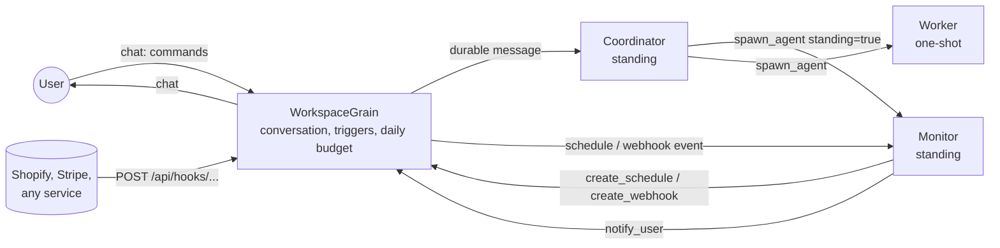

# Workspaces

A workspace is a long-running environment where a user's agents live. The user describes what
they want once, or keeps giving instructions over time. The agents set themselves up (standing
monitors, schedules, webhooks) and keep working for as long as the workspace exists, surviving
restarts and crashes (see [durability.md](durability.md)).

```mermaid
flowchart LR
    User((User)) -- "chat: commands" --> WS[WorkspaceGrain<br/>conversation, triggers, daily budget]
    WS -- "durable message" --> Coord[Coordinator<br/>standing]
    Coord -- "spawn_agent standing=true" --> Mon[Monitor<br/>standing]
    Coord -- "spawn_agent" --> Worker[Worker<br/>one-shot]
    Mon -- "create_schedule / create_webhook" --> WS
    Shopify[(Shopify, Stripe,<br/>any service)] -- "POST /api/hooks/..." --> WS
    WS -- "schedule / webhook event" --> Mon
    Mon -- "notify_user" --> WS
    WS -- "chat" --> User
```

## Pieces

| Piece | What it is |
|---|---|
| **Coordinator** | A standing agent created with the workspace. It receives every user message and decides whether to do the work itself, hand it to an existing agent (`find_agents`, `send_message`), or spawn a new one. It never completes. |
| **Standing agent** | Spawned with `spawn_agent standing=true`. It handles each wake-up (message, schedule, webhook, a child finishing), then calls `wait_for_events`. It sees a sliding window of recent history (`Workspaces:StandingContextWindow`) and keeps long-lived facts in `write_memory`. Its budget renews every 24 hours. |
| **Worker** | Spawned with `standing=false`. It does one job, then calls `complete_task`, and its parent is notified automatically. |
| **Schedule** | `create_schedule` with `every_minutes` or a 5-field UTC `cron` expression. Backed by an Orleans reminder, so it survives crashes and restarts. |
| **Webhook** | `create_webhook` creates `POST /api/hooks/{workspace}/{trigger}/{secret}`. The secret URL is shown to the user, never to an agent. |
| **Conversation** | The user's messages, agents' `notify_user` messages (with urgency `info`, `warning` or `urgent`), and system notices. Phase 3 connectors (Slack, SMS, email) will forward these. |
| **Daily budget** | One token and dollar limit for the whole workspace per UTC day, checked by the runtime before every LLM call. When it's used up, agents pause until midnight UTC and the user is told once. |

## Webhooks

- **Authentication:** the secret in the URL, compared in constant time. A wrong secret and an
  unknown trigger both return `404`, so ids can't be probed.
- **Acknowledgement:** `202 Accepted` is returned only after the event is durably in the target
  agent's mailbox.
- **Deduplication:** senders retry, so redeliveries are dropped. The delivery id is taken from
  `Idempotency-Key`, `X-Shopify-Webhook-Id`, `X-GitHub-Delivery`, `Webhook-Id`, `X-Request-Id`
  or `X-Delivery-Id`, or failing that the body within the same minute. A duplicate returns
  `200 {"status":"duplicate"}`.
- **Rate limiting:** deliveries beyond `Workspaces:MaxWebhookEventsPerMinute` per trigger get
  `429` and are counted as dropped. A chatty integration can't turn into an LLM bill.
- **Payload handling:** payloads are truncated to `Workspaces:MaxWebhookPayloadChars` and
  labelled as untrusted external data for the agent. Bodies over `MaxWebhookBodyBytes` get `413`.
- **Paused or archived workspaces** return `409`.
- **Dead targets:** if a trigger's agent is no longer running, the event goes to the coordinator
  with a note, so nothing fires into the void.

## Token efficiency

Everything that runs indefinitely is designed to cost nothing while nothing is happening:
- **No polling loops:** agents only run when woken by an event.
- **Flat cost per wake-up:** standing agents see a bounded window of history, however long they've
  been running.
- **Prompt rules for workspace agents:**
  - prefer webhooks over polling;
  - pick the longest schedule interval that works;
  - reuse existing agents and triggers instead of creating new ones;
  - never send "nothing happened" notifications.
- **Hard caps:** a daily per-agent budget and a daily workspace budget, enforced by the runtime.
- **Resuming is cheap:** resuming a paused workspace unpauses agents without forcing an LLM call
  for each one.

Phase 4 adds compiled watchers: rules the LLM writes once, which the runtime evaluates without an
LLM call. For example, "alert when stock < 10" would cost zero tokens per check.

## The workspace screen

The middle of the screen shows the team working, like the simulation map. You sit at the top, then
the coordinator, then the agents it started, joined by dashed lines. For about 20 seconds after
something happens:
- messages between agents animate as coloured arrows (task, done, question and answer, started);
- chat goes between you and the coordinator;
- speech bubbles show what each agent last said or did, such as planning, saving a file or searching.

Workers that finished over 30 minutes ago are hidden behind a "Show earlier finished agents"
button. The chat is a floating widget in the corner: minimise it to watch, and it counts replies and
pending approvals while minimised. The side panel keeps the Agents, Files, Triggers, Integrations,
Safety and Events tabs.

## Files

Agents save deliverables (reports, documents, data, code) with `filesystem_write`. The prompt asks
them to use a clear name and to mention the file in `notify_user`. Files live in the workspace's own
sandbox folder and appear in the **Files** tab, which reloads whenever an agent saves one. Download
them one at a time or all as a zip. Each file is labelled by its author's state:
- **final:** the worker that wrote it has finished;
- **in progress:** that worker is still running, so the file may change;
- **unfinished:** that worker failed or was stopped;
- **saved:** a standing agent or the coordinator wrote it. These never finish, so there's no "final" moment.

Only files inside the workspace's sandbox, for the caller's organization, are ever served.

## How many agents a request gets

Each agent resends its whole prompt on every step, so an agent that isn't needed costs more than
the work it does. The model decides whether to spawn, and the runtime limits the damage when it
decides badly.

**Prompts (the model's side).** Agents are told to do the work themselves by default. They spawn
only for a part that is substantial and can run in parallel, that needs tools or expertise they
lack, or that won't fit in their budget. A sequence of steps is one agent's job. The coordinator
handles most requests (a question, a lookup, a short report) alone and uses a standing agent only
for ongoing work.

**Planning (`plan_request`).** Before a request with more than a couple of steps, an agent lists its
parts. For each part it gives a size (small, medium, large) and whether it needs another part's result
first. The model is good at that breakdown, and the decision that follows is a fixed rule applied by
the runtime (`WorkPlanner`):
- **split:** two or more parts are medium or large and independent, so one worker per part (up to the
  per-request cap; extra parts are grouped). The agent does the small or dependent parts itself and
  combines the workers' results;
- **delegate:** the only substantial independent part is large, so it goes to one worker. That keeps the
  coordinator free to answer the user;
- **self:** otherwise the agent does everything itself.

The plan's worker count becomes the agent's worker allowance for that request. A worker spawn with
no plan, or beyond the plan, is rejected. Standing agents for ongoing work don't need a plan. This
is how "research the governments of Togo, Nigeria and Ivory Coast" becomes three parallel workers
without the user asking for parallel work.

**Runtime rules (enforced whatever the model says):**

| Rule | Effect |
|---|---|
| `spawn_agent` requires `why_not_myself` | A spawn without a stated reason is rejected. The reason appears in the `AgentSpawnRequested` and `AgentSpawned` events, so the event stream shows why each agent exists. |
| At most `Workspaces:MaxSpawnsPerRequest` (default 3) spawns per request | Counted per agent. The count resets on a new user message or environment event (schedule, webhook), not when a child reports back, so a chain of replies can't keep reopening it. |
| Workers can't spawn | One-shot workers get no `spawn_agent` tool and a `MaxChildren` of 0. Standing agents can still spawn workers. |
| The spawn result states the cost | For example: "This worker may spend up to 150,000 tokens / $0.75, paid from the workspace's shared daily budget (412,000 tokens / $1.64 left today)." |

## Running out of budget

An agent with a lifetime budget (a worker, or any task agent) doesn't fail when its budget runs
out. `BudgetGuard` checks before every LLM call:

1. **Warning.** Once 75% (`RuntimeLimits:WrapUpAtFraction`) of any budget is spent (tokens, tool
   calls, cost or time), or only a few calls' worth of tokens remain, the agent is told to finish
   and to report a `partial` result if it can't.
2. **Final step.** When only one more call fits, that call offers nothing but `complete_task`, with
   output capped at `RuntimeLimits:FinalStepMaxOutputTokens`. `complete_task` is exempt from the
   tool-call budget, so an agent out of tool calls can still report.
3. **Runtime report.** If the agent doesn't report in that call, or not even one more call fits,
   the runtime completes it as `partial` with its latest notes and the unfinished goal as
   remaining work.

Either way the parent receives a completion notice with the remaining work and a suggestion to do
the rest itself or give just that rest to one new agent. A partial result sends the leftover work
back up the tree.

Time works the same way. An agent parked on a reply that never comes runs no steps of its own, so
a deadline reminder wakes it when its time budget ends and it takes its final step. Standing
agents are unaffected: their budgets renew daily and they pause instead.

`SpawnEfficiencyEval` measures the model's side against a real model. It runs only when
`EVAL_LLM_PROVIDER` and `EVAL_LLM_MODEL` are set; see the class comment.

## API

| Method | Path | |
|---|---|---|
| `POST` | `/api/workspaces` | `{name, goal, daily_token_limit?, daily_cost_limit_usd?}` |
| `GET` | `/api/workspaces` | List |
| `GET` | `/api/workspaces/{id}` | Snapshot: conversation, agents, triggers, budget |
| `POST` | `/api/workspaces/{id}/messages` | `{text, to_agent_id?, client_message_id?}`; retries with the same `client_message_id` deliver once |
| `GET` / `POST` | `/api/workspaces/{id}/triggers` | `{kind: schedule\|webhook, name, instruction, target_agent_id?, every_minutes?, cron?}`; a created webhook's response includes its secret `webhook_path` |
| `DELETE` | `/api/workspaces/{id}/triggers/{triggerId}` | |
| `PUT` | `/api/workspaces/{id}/budget` | `{daily_token_limit?, daily_cost_limit_usd?}` |
| `POST` | `/api/workspaces/{id}/pause` \| `resume` \| `archive` | |
| `GET` | `/api/workspaces/{id}/files` | Files agents saved with `filesystem_write`: one entry per file (its latest write), newest first, with author, size and version count |
| `GET` | `/api/workspaces/{id}/files/{artifactId}/content` | Download one file |
| `GET` | `/api/workspaces/{id}/files.zip` | Every file as one zip, keeping folders |
| `POST` | `/api/hooks/{workspaceId}/{triggerId}/{secret}` | Inbound webhook (public) |

The live event stream is `/ws/events?taskId={workspaceId}`.

## Tests

`WorkspaceTests` checks, with a scripted LLM:
- a goal becomes a standing agent whose schedule reports each time it fires;
- a user command sent twice with the same client id is delivered once;
- webhooks: the wrong secret is rejected, a redelivery is deduplicated, a burst is rate-limited,
  and the secret never appears in anything an agent sees;
- the daily budget stops LLM calls and posts one notice;
- pause stops triggers and resume starts them;
- schedules keep firing after the silo is killed.

`SpawnDisciplineTests` checks that one request starts at most three agents (and the next request
gets a fresh allowance), that a spawn without a reason is rejected, and that workers can't spawn. It
also checks that a worker needs a plan, and that a plan of small parts allows none. `WorkPlannerTests`
covers the split, delegate and self rule.

`BudgetWrapUpTests` checks that an agent running out of tokens is warned, then reports a partial
result at its final step. It also covers an agent that ignores its final step (the runtime reports
for it), an agent out of tool calls that can still report, and an agent parked past its deadline
that is woken to report. `BudgetGuardTests` covers the thresholds.

`ArtifactFilesTests` checks that each file is listed once, as its latest write; that files outside
the sandbox or already deleted are never offered; and that the zip keeps the folder layout.

`CronScheduleTests` covers cron parsing.
